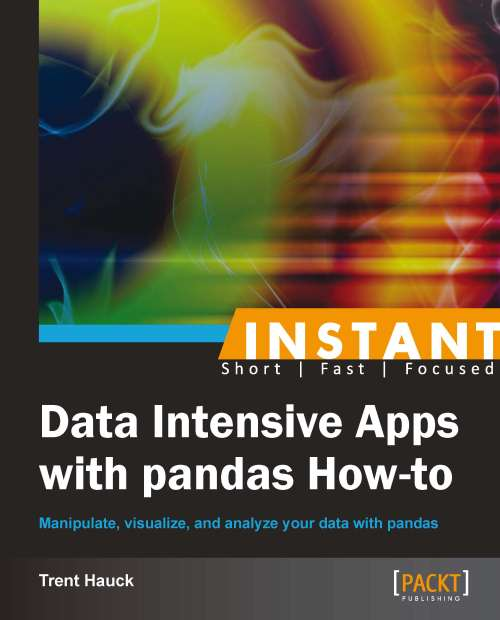

# Instant Data Intensive Apps with Pandas How-to

## Info
* [Packt](https://www.packtpub.com/big-data-and-business-intelligence/instant-data-intensive-apps-pandas-how-instant)

## Toc
* [Ch01 Working with files](Ch01_WorkingWithFiles.md)
* [Ch02 Slicing pandas objects](Ch02_SlicingPandasObjects.md)
* [Ch03 Subsetting data](Ch03_SubsettingData.md)
* [Ch04 Working with dates](Ch04_WorkingWithDates.md)
* [Ch05 Modifying data with functions](Ch05_ModifyingDataWithFunctions.md)
* [Ch06 Combining datasets](Ch06_CombiningDatasets.md)
* [Ch07 Using indexes to manipulate objects](Ch07_UsingIndexes.md)
* [Ch08 Getting data from the Web](Ch08_GettingData.md)
* [Ch09 Combining pandas with scikit-learn](Ch09_CombiningPandasWithSciKitLearn.md)
* [Ch10 Integrating pandas with statistics packages](Ch10_IntegratingPandasWithStatsPackages.md)
* [Ch11 Using Flask for the backend](Ch11_UsingFlaskforthebackend.md)
* [Ch12 Visualizing pandas objects](Ch12_VisualizingPandasObjects.md)
* [Ch13 Reporting with pandas objects](Ch13_Reportingwithpandasobjects.md)