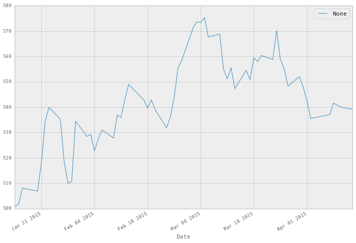

<!-- toc orderedList:0 depthFrom:1 depthTo:6 -->

- [Importing pandas into your application](#importing-pandas-into-your-application)
- [Primary pandas objects](#primary-pandas-objects)
	- [The pandas Series](#the-pandas-series)
	- [The pandas DataFrame](#the-pandas-dataframe)
- [Loading data from files and the web into a DataFrame](#loading-data-from-files-and-the-web-into-a-dataframe)
- [Visualizing Data](#visualizing-data)

<!-- tocstop -->


# Importing pandas into your application


```{python}
# import numpy and pandas, and DataFrame / Series
import numpy as np
import pandas as pd
from pandas import DataFrame, Series

# Set some pandas options
pd.set_option('display.notebook_repr_html', False)
pd.set_option('display.max_columns', 10)
pd.set_option('display.max_rows', 10)

# And some items for matplotlib
%matplotlib inline
import matplotlib.pyplot as plt
pd.options.display.mpl_style = 'default'
```

# Primary pandas objects

## The pandas Series

```{python}
# create a four item Series
s = Series([1, 2, 3, 4])
s
```


    0    1
    1    2
    2    3
    3    4
    dtype: int64


```{python}
# return a Series with the row with labels 1 and 3
s[[1, 3]]
```


    1    2
    3    4
    dtype: int64


```{python}
# create a series using an explicit index
s = Series([1, 2, 3, 4],
           index = ['a', 'b', 'c', 'd'])
s
```


    a    1
    b    2
    c    3
    d    4
    dtype: int64


```{python}
# look up items the series having index 'a' and 'd'
s[['a', 'd']]
```


    a    1
    d    4
    dtype: int64


```{python}
# passing a list of integers to a Series that has
# non-integer index labels will look up based upon
# 0-based index like an array
s[[1, 2]]
```


    b    2
    c    3
    dtype: int64


```{python}
# get only the index of the Series
s.index
```


    Index([u'a', u'b', u'c', u'd'], dtype='object')


```{python}
# create a Series who's index is a series of dates
# between the two specified dates (inclusive)
dates = pd.date_range('2014-07-01', '2014-07-06')
dates
```


    <class 'pandas.tseries.index.DatetimeIndex'>
    [2014-07-01, ..., 2014-07-06]
    Length: 6, Freq: D, Timezone: None


```{python}
# create a Series with values (representing temperatures)
# for each date in the index
temps1 = Series([80, 82, 85, 90, 83, 87],
                index = dates)
temps1
```


    2014-07-01    80
    2014-07-02    82
    2014-07-03    85
    2014-07-04    90
    2014-07-05    83
    2014-07-06    87
    Freq: D, dtype: int64


```{python}
# calculate the mean of the values in the Series
temps1.mean()
```


    84.5


```{python}
# create a second series of values using the same index
temps2 = Series([70, 75, 69, 83, 79, 77],
                index = dates)
# the following aligns the two by their index values
# and calculates the difference at those matching labels
temp_diffs = temps1 - temps2
temp_diffs
```


    2014-07-01    10
    2014-07-02     7
    2014-07-03    16
    2014-07-04     7
    2014-07-05     4
    2014-07-06    10
    Freq: D, dtype: int64


```{python}
# lookup a value by date using the index
temp_diffs['2014-07-03']
```


    16


```{python}
# and also possible by integer position as if the
# series was an array
temp_diffs[2]
```


    16


## The pandas DataFrame


```{python}
# create a DataFrame from the two series objects temp1 and temp2
# and give them column names
temps_df = DataFrame(
            {'Missoula': temps1,
             'Philadelphia': temps2})
temps_df
```


                Missoula  Philadelphia
    2014-07-01        80            70
    2014-07-02        82            75
    2014-07-03        85            69
    2014-07-04        90            83
    2014-07-05        83            79
    2014-07-06        87            77


```{python}
# get the column with the name Missoula
temps_df['Missoula']
```


    2014-07-01    80
    2014-07-02    82
    2014-07-03    85
    2014-07-04    90
    2014-07-05    83
    2014-07-06    87
    Freq: D, Name: Missoula, dtype: int64


```{python}
# likewise we can get just the Philadelphia column
temps_df['Philadelphia']
```


    2014-07-01    70
    2014-07-02    75
    2014-07-03    69
    2014-07-04    83
    2014-07-05    79
    2014-07-06    77
    Freq: D, Name: Philadelphia, dtype: int64


```{python}
# return both columns in a different order
temps_df[['Philadelphia', 'Missoula']]
```


                Philadelphia  Missoula
    2014-07-01            70        80
    2014-07-02            75        82
    2014-07-03            69        85
    2014-07-04            83        90
    2014-07-05            79        83
    2014-07-06            77        87


```{python}
# retrieve the Missoula column through property syntax
temps_df.Missoula
```


    2014-07-01    80
    2014-07-02    82
    2014-07-03    85
    2014-07-04    90
    2014-07-05    83
    2014-07-06    87
    Freq: D, Name: Missoula, dtype: int64


```{python}
# calculate the temperature difference between the two cities
temps_df.Missoula - temps_df.Philadelphia
```


    2014-07-01    10
    2014-07-02     7
    2014-07-03    16
    2014-07-04     7
    2014-07-05     4
    2014-07-06    10
    Freq: D, dtype: int64


```{python}
# add a column to temp_df which contains the difference in temps
temps_df['Difference'] = temp_diffs
temps_df
```


                Missoula  Philadelphia  Difference
    2014-07-01        80            70          10
    2014-07-02        82            75           7
    2014-07-03        85            69          16
    2014-07-04        90            83           7
    2014-07-05        83            79           4
    2014-07-06        87            77          10


```{python}
# get the columns, which is also an Index object
temps_df.columns
```


    Index([u'Missoula', u'Philadelphia', u'Difference'], dtype='object')


```{python}
# slice the temp differences column for the rows at
# location 1 through 4 (as though it is an array)
temps_df.Difference[1:4]
```


    2014-07-02     7
    2014-07-03    16
    2014-07-04     7
    Freq: D, Name: Difference, dtype: int64


```{python}
# get the row at array position 1
temps_df.iloc[1]
```


    Missoula        82
    Philadelphia    75
    Difference       7
    Name: 2014-07-02 00:00:00, dtype: int64


```{python}
# the names of the columns have become the index
# they have been 'pivoted'
temps_df.ix[1].index
```


    Index([u'Missoula', u'Philadelphia', u'Difference'], dtype='object')


```{python}
# retrieve row by index label using .loc
temps_df.loc['2014-07-03']
```


    Missoula        85
    Philadelphia    69
    Difference      16
    Name: 2014-07-03 00:00:00, dtype: int64


```{python}
# get the values in the Differences column in tows 1, 3 and 5
# using 0-based location
temps_df.iloc[[1, 3, 5]].Difference
```


    2014-07-02     7
    2014-07-04     7
    2014-07-06    10
    Name: Difference, dtype: int64


```{python}
# which values in the Missoula column are > 82?
temps_df.Missoula > 82
```


    2014-07-01    False
    2014-07-02    False
    2014-07-03     True
    2014-07-04     True
    2014-07-05     True
    2014-07-06     True
    Freq: D, Name: Missoula, dtype: bool


```{python}
# return the rows where the temps for Missoula > 82
temps_df[temps_df.Missoula > 82]
```


                Missoula  Philadelphia  Difference
    2014-07-03        85            69          16
    2014-07-04        90            83           7
    2014-07-05        83            79           4
    2014-07-06        87            77          10


# Loading data from files and the web into a DataFrame


```{python}
# display the contents of test1.csv
# which command to use depends on your OS
!cat data/test1.csv # on non-windows systems
#!type data/test1.csv # on windows systems
```

    date,0,1,2
    2000-01-01 00:00:00,1.10376250134,-1.90997889703,-0.808955536115
    2000-01-02 00:00:00,1.18891664768,0.581119740849,0.86159734949
    2000-01-03 00:00:00,-0.964200042412,0.779764393246,1.82906224532
    2000-01-04 00:00:00,0.782130444001,-1.72066965573,-1.10824167327
    2000-01-05 00:00:00,-1.86701699823,-0.528368292754,-2.48830894087
    2000-01-06 00:00:00,2.56928022646,-0.471901478927,-0.835033249865
    2000-01-07 00:00:00,-0.39932258251,-0.676426550985,-0.0112559158931
    2000-01-08 00:00:00,1.64299299394,1.01341997845,1.43566709724
    2000-01-09 00:00:00,1.14730764657,2.13799951538,0.554171306191
    2000-01-10 00:00:00,0.933765825769,1.38715526486,-0.560142729978


```{python}
# read the contents of the file into a DataFrame
df = pd.read_csv('data/test1.csv')
df
```


                      date         0         1         2
    0  2000-01-01 00:00:00  1.103763 -1.909979 -0.808956
    1  2000-01-02 00:00:00  1.188917  0.581120  0.861597
    2  2000-01-03 00:00:00 -0.964200  0.779764  1.829062
    3  2000-01-04 00:00:00  0.782130 -1.720670 -1.108242
    4  2000-01-05 00:00:00 -1.867017 -0.528368 -2.488309
    5  2000-01-06 00:00:00  2.569280 -0.471901 -0.835033
    6  2000-01-07 00:00:00 -0.399323 -0.676427 -0.011256
    7  2000-01-08 00:00:00  1.642993  1.013420  1.435667
    8  2000-01-09 00:00:00  1.147308  2.138000  0.554171
    9  2000-01-10 00:00:00  0.933766  1.387155 -0.560143


```{python}
# the contents of the date column
df.date
```


    0    2000-01-01 00:00:00
    1    2000-01-02 00:00:00
    2    2000-01-03 00:00:00
    3    2000-01-04 00:00:00
    4    2000-01-05 00:00:00
    5    2000-01-06 00:00:00
    6    2000-01-07 00:00:00
    7    2000-01-08 00:00:00
    8    2000-01-09 00:00:00
    9    2000-01-10 00:00:00
    Name: date, dtype: object


```{python}
# we can get the first value in the date column
df.date[0]
```


    '2000-01-01 00:00:00'


```{python}
# it is a string
type(df.date[0])
```


    str


```{python}
# read the data and tell pandas the date column should be
# a date in the resulting DataFrame
df = pd.read_csv('data/test1.csv', parse_dates=['date'])
df
```


            date         0         1         2
    0 2000-01-01  1.103763 -1.909979 -0.808956
    1 2000-01-02  1.188917  0.581120  0.861597
    2 2000-01-03 -0.964200  0.779764  1.829062
    3 2000-01-04  0.782130 -1.720670 -1.108242
    4 2000-01-05 -1.867017 -0.528368 -2.488309
    5 2000-01-06  2.569280 -0.471901 -0.835033
    6 2000-01-07 -0.399323 -0.676427 -0.011256
    7 2000-01-08  1.642993  1.013420  1.435667
    8 2000-01-09  1.147308  2.138000  0.554171
    9 2000-01-10  0.933766  1.387155 -0.560143


```{python}
# verify the type now is date
# in pandas, this is actually a Timestamp
type(df.date[0])
```


    pandas.tslib.Timestamp


```{python}
# unfortunately the index is numeric which makes
# accessing data by date more complicated
df.index
```


    Int64Index([0, 1, 2, 3, 4, 5, 6, 7, 8, 9], dtype='int64')


```{python}
# read in again, now specity the data column as being the
# index of the resulting DataFrame
df = pd.read_csv('data/test1.csv',
                 parse_dates=['date'],
                 index_col='date')
df
```


                       0         1         2
    date                                    
    2000-01-01  1.103763 -1.909979 -0.808956
    2000-01-02  1.188917  0.581120  0.861597
    2000-01-03 -0.964200  0.779764  1.829062
    2000-01-04  0.782130 -1.720670 -1.108242
    2000-01-05 -1.867017 -0.528368 -2.488309
    2000-01-06  2.569280 -0.471901 -0.835033
    2000-01-07 -0.399323 -0.676427 -0.011256
    2000-01-08  1.642993  1.013420  1.435667
    2000-01-09  1.147308  2.138000  0.554171
    2000-01-10  0.933766  1.387155 -0.560143


```{python}
# and the index is now a DatetimeIndex
df.index
```


    <class 'pandas.tseries.index.DatetimeIndex'>
    [2000-01-01, ..., 2000-01-10]
    Length: 10, Freq: None, Timezone: None


```{python}
# imports for reading data from Yahoo!
from pandas.io.data import DataReader
from datetime import date
from dateutil.relativedelta import relativedelta

# read the last three months of data for GOOG
goog = DataReader("GOOG",  "yahoo",
                  date.today() +
                  relativedelta(months=-3))

# the result is a DataFrame
#and this gives us the 5 most recent prices
goog.tail()
```


                  Open    High     Low   Close   Volume  Adj Close
    Date                                                          
    2015-04-07  538.08  542.69  536.00  537.02  1298000     537.02
    2015-04-08  538.38  543.85  538.38  541.61  1170400     541.61
    2015-04-09  541.03  541.95  535.49  540.78  1549700     540.78
    2015-04-10  542.29  542.29  537.31  540.01  1400800     540.01
    2015-04-13  538.41  544.06  537.31  539.17  1628900     539.17


# Visualizing Data


```{python}
# plot the Adj Close values we just read in
goog.plot(y='Adj Close', figsize=(12,8));
plt.savefig('5128OS_01_02.png', bbox_inches='tight', dpi=300)
```



