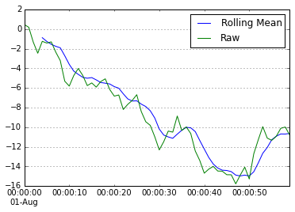
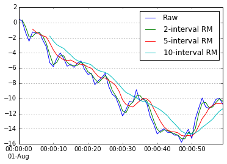
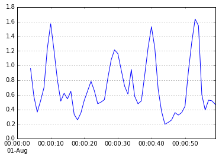
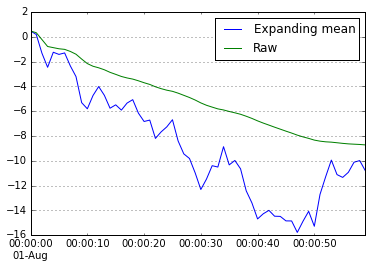

<!-- toc orderedList:0 depthFrom:1 depthTo:6 -->

- [Setting up the notebook](#setting-up-the-notebook)
- [Representation of dates, time, and intervals](#representation-of-dates-time-and-intervals)
	- [Datetime, date and time objects](#datetime-date-and-time-objects)
	- [Timestamps](#timestamps)
	- [Timedelta](#timedelta)
- [Time-series data](#time-series-data)
	- [The DatetimeIndex](#the-datetimeindex)
	- [Creating time-series data with specific frequencies](#creating-time-series-data-with-specific-frequencies)
- [Calculating new dates using offsets](#calculating-new-dates-using-offsets)
	- [Date offsets](#date-offsets)
	- [Anchored Offsets](#anchored-offsets)
- [Durations of time using Period objects](#durations-of-time-using-period-objects)
	- [The Period](#the-period)
	- [The PeriodIndex](#the-periodindex)
- [Handling holidays using calendars](#handling-holidays-using-calendars)
- [Normalizing timestamps using time zones](#normalizing-timestamps-using-time-zones)
- [Manipulating time-series data](#manipulating-time-series-data)
	- [Shifting and lagging](#shifting-and-lagging)
	- [Frequency Conversion](#frequency-conversion)
	- [Up and down resampling](#up-and-down-resampling)
- [Time series moving window operations](#time-series-moving-window-operations)

<!-- tocstop -->


# Setting up the notebook
```{python}
# import pandas, numpy and datetime
import numpy as np
import pandas as pd

# needed for representing dates and times
import datetime
from datetime import datetime

# Set some pandas options for controlling output
pd.set_option('display.notebook_repr_html', False)
pd.set_option('display.max_columns', 10)
pd.set_option('display.max_rows', 10)

# matplotlib and inline graphics
import matplotlib.pyplot as plt
%matplotlib inline
```

# Representation of dates, time, and intervals

## Datetime, date and time objects


```{python}
# datetime object for Dec 15 2014
datetime(2014, 12, 15)
```


    datetime.datetime(2014, 12, 15, 0, 0)


```{python}
# specific date and also with a time of 5:30 pm
datetime(2014, 12, 15, 17, 30)
```


    datetime.datetime(2014, 12, 15, 17, 30)


```{python}
# get the local "now" (date and time)
# can take a timezone, but that's not demonstrated here
datetime.now()
```


    datetime.datetime(2015, 4, 14, 0, 27, 53, 373896)


```{python}
# a date without time can be represented
# by creating a date using a datetime object
datetime.date(datetime(2014, 12, 15))
```


    datetime.date(2014, 12, 15)


```{python}
# get just the current date
datetime.now().date()
```


    datetime.date(2015, 4, 14)


```{python}
# get just a time from a datetime
datetime.time(datetime(2014, 12, 15, 17, 30))
```


    datetime.time(17, 30)


```{python}
# get the current local time
datetime.now().time()
```


    datetime.time(0, 27, 53, 388752)


## Timestamps


```{python}
# a timestamp representing a specific date
pd.Timestamp('2014-12-15')
```


    Timestamp('2014-12-15 00:00:00')


```{python}
# a timestamp with both date and time
pd.Timestamp('2014-12-15 17:30')
```


    Timestamp('2014-12-15 17:30:00')


```{python}
# timestamp with just a time
# which adds in the current local date
pd.Timestamp('17:30')
```


    Timestamp('2015-04-14 17:30:00')


```{python}
# get the current date and time (now)
pd.Timestamp("now")
```


    Timestamp('2015-04-14 00:27:53.402828')


## Timedelta


```{python}
# what is one day from 2014-11-30?
today = datetime(2014, 11, 30)
tomorrow = today + pd.Timedelta(days=1)
tomorrow
```


    datetime.datetime(2014, 12, 1, 0, 0)


```{python}
# how many days between these two dates?
date1 = datetime(2014, 12, 2)
date2 = datetime(2014, 11, 28)
date1 - date2
```


    datetime.timedelta(4)


# Time-series data

## The DatetimeIndex


```{python}
# create a very simple time-series with two index labels
# and random values
dates = [datetime(2014, 8, 1), datetime(2014, 8, 2)]
ts = pd.Series(np.random.randn(2), dates)
ts
```


    2014-08-01   -0.107208
    2014-08-02   -1.054658
    dtype: float64


```{python}
# what is the type of the index?
type(ts.index)
```


    pandas.tseries.index.DatetimeIndex


```{python}
# and we can see it is a collection of timestamps
type(ts.index[0])
```


    pandas.tslib.Timestamp


```{python}
# create from just a list of dates as strings!
np.random.seed(123456)
dates = ['2014-08-01', '2014-08-02']
ts = pd.Series(np.random.randn(2), dates)
ts
```


    2014-08-01    0.469112
    2014-08-02   -0.282863
    dtype: float64


```{python}
# convert a sequence of objects to a DatetimeIndex
dti = pd.to_datetime(['Aug 1, 2014',
                      '2014-08-02',
                      '2014.8.3',
                      None])
for l in dti: print (l)
```

    2014-08-01 00:00:00
    2014-08-02 00:00:00
    2014-08-03 00:00:00
    NaT


```{python}
# this is a list of objects, not timestamps...
pd.to_datetime(['Aug 1, 2014', 'foo'])
```


    array(['Aug 1, 2014', 'foo'], dtype=object)


```{python}
# force the conversion, NaT for items that dont work
pd.to_datetime(['Aug 1, 2014', 'foo'], coerce=True)
```


    <class 'pandas.tseries.index.DatetimeIndex'>
    [2014-08-01, NaT]
    Length: 2, Freq: None, Timezone: None


```{python}
# create a range of dates starting at a specific date
# and for a specific number of days, creating a Series
np.random.seed(123456)
periods = pd.date_range('8/1/2014', periods=10)
date_series = pd.Series(np.random.randn(10), index=periods)
date_series
```


    2014-08-01    0.469112
    2014-08-02   -0.282863
    2014-08-03   -1.509059
    2014-08-04   -1.135632
    2014-08-05    1.212112
    2014-08-06   -0.173215
    2014-08-07    0.119209
    2014-08-08   -1.044236
    2014-08-09   -0.861849
    2014-08-10   -2.104569
    Freq: D, dtype: float64


```{python}
# slice by location
subset = date_series[3:7]
subset
```


    2014-08-04   -1.135632
    2014-08-05    1.212112
    2014-08-06   -0.173215
    2014-08-07    0.119209
    Freq: D, dtype: float64


```{python}
# a Series to demonstrate alignment
s2 = pd.Series([10, 100, 1000, 10000], subset.index)
s2
```


    2014-08-04       10
    2014-08-05      100
    2014-08-06     1000
    2014-08-07    10000
    Freq: D, dtype: int64


```{python}
# demonstrate alignment by date on a subset of items
date_series + s2
```


    2014-08-01             NaN
    2014-08-02             NaN
    2014-08-03             NaN
    2014-08-04        8.864368
    2014-08-05      101.212112
    2014-08-06      999.826785
    2014-08-07    10000.119209
    2014-08-08             NaN
    2014-08-09             NaN
    2014-08-10             NaN
    Freq: D, dtype: float64


```{python}
# lookup item by a string representing a date
date_series['2014-08-05']
```


    1.2121120250208506


```{python}
# slice between two dates specified by string representing dates
date_series['2014-08-05':'2014-08-07']
```


    2014-08-05    1.212112
    2014-08-06   -0.173215
    2014-08-07    0.119209
    Freq: D, dtype: float64


```{python}
# a two year range of daily data in a Series
# only select those in 2013
s3 = pd.Series(0, pd.date_range('2013-01-01', '2014-12-31'))
s3['2013']
```


    2013-01-01    0
    2013-01-02    0
    2013-01-03    0
    ...
    2013-12-29    0
    2013-12-30    0
    2013-12-31    0
    Freq: D, Length: 365


```{python}
# 31 items for May 2014
s3['2014-05']
```


    2014-05-01    0
    2014-05-02    0
    2014-05-03    0
    ...
    2014-05-29    0
    2014-05-30    0
    2014-05-31    0
    Freq: D, Length: 31


```{python}
# items between two months
s3['2014-08':'2014-09']
```


    2014-08-01    0
    2014-08-02    0
    2014-08-03    0
    ...
    2014-09-28    0
    2014-09-29    0
    2014-09-30    0
    Freq: D, Length: 61


## Creating time-series data with specific frequencies


```{python}
# generate a Series at one minute intervals
np.random.seed(123456)
bymin = pd.Series(np.random.randn(24*60*90),
                  pd.date_range('2014-08-01',
                                '2014-10-29 23:59',
                                freq='T'))
bymin
```


    2014-08-01 00:00:00    0.469112
    2014-08-01 00:01:00   -0.282863
    2014-08-01 00:02:00   -1.509059
    ...
    2014-10-29 23:57:00    1.850604
    2014-10-29 23:58:00   -1.589660
    2014-10-29 23:59:00    0.266429
    Freq: T, Length: 129600


```{python}
# slice down to the minute
bymin['2014-08-01 00:02':'2014-08-01 00:10']
```


    2014-08-01 00:02:00   -1.509059
    2014-08-01 00:03:00   -1.135632
    2014-08-01 00:04:00    1.212112
    2014-08-01 00:05:00   -0.173215
    2014-08-01 00:06:00    0.119209
    2014-08-01 00:07:00   -1.044236
    2014-08-01 00:08:00   -0.861849
    2014-08-01 00:09:00   -2.104569
    2014-08-01 00:10:00   -0.494929
    Freq: T, dtype: float64


```{python}
# generate a series based upon business days
days = pd.date_range('2014-08-29', '2014-09-05', freq='B')
for d in days : print (d)
```

    2014-08-29 00:00:00
    2014-09-01 00:00:00
    2014-09-02 00:00:00
    2014-09-03 00:00:00
    2014-09-04 00:00:00
    2014-09-05 00:00:00


```{python}
# periods will use the frequency as the increment
pd.date_range('2014-08-01 12:10:01', freq='S', periods=10)
```


    <class 'pandas.tseries.index.DatetimeIndex'>
    [2014-08-01 12:10:01, ..., 2014-08-01 12:10:10]
    Length: 10, Freq: S, Timezone: None


# Calculating new dates using offsets

## Date offsets


```{python}
# get all business days between and inclusive of these two dates
dti = pd.date_range('2014-08-29', '2014-09-05', freq='B')
dti.values
```


    array(['2014-08-28T18:00:00.000000000-0600',
           '2014-08-31T18:00:00.000000000-0600',
           '2014-09-01T18:00:00.000000000-0600',
           '2014-09-02T18:00:00.000000000-0600',
           '2014-09-03T18:00:00.000000000-0600',
           '2014-09-04T18:00:00.000000000-0600'], dtype='datetime64[ns]')


```{python}
# check the frequency is BusinessDay
dti.freq
```


    <BusinessDay>


```{python}
# calculate a one day offset from 2014-8-29
d = datetime(2014, 8, 29)
do = pd.DateOffset(days = 1)
d + do
```


    Timestamp('2014-08-30 00:00:00')


```{python}
# import the data offset types
from pandas.tseries.offsets import *
# calculate one business day from 2014-8-31
d + BusinessDay()
```


    Timestamp('2014-09-01 00:00:00')


```{python}
# determine 2 business days from 2014-8-29
d + 2 * BusinessDay()
```


    Timestamp('2014-09-02 00:00:00')


```{python}
# what is the next business month end
# from a specific date?
d + BMonthEnd()
```


    Timestamp('2014-09-30 00:00:00')


```{python}
# calculate the next month end by
# rolling forward from a specific date
BMonthEnd().rollforward(datetime(2014, 9, 15))
```


    Timestamp('2014-09-30 00:00:00')


```{python}
# calculate the date of the Tuesday previous
# to a specified date
d - Week(weekday = 1)
```


    Timestamp('2014-08-26 00:00:00')


## Anchored Offsets


```{python}
# calculate all Wednesdays between 2014-06-01
# and 2014-08-31
wednesdays = pd.date_range('2014-06-01',
                           '2014-08-31', freq="W-WED")
wednesdays.values
```


    array(['2014-06-03T18:00:00.000000000-0600',
           '2014-06-10T18:00:00.000000000-0600',
           '2014-06-17T18:00:00.000000000-0600',
           '2014-06-24T18:00:00.000000000-0600',
           '2014-07-01T18:00:00.000000000-0600',
           '2014-07-08T18:00:00.000000000-0600',
           '2014-07-15T18:00:00.000000000-0600',
           '2014-07-22T18:00:00.000000000-0600',
           '2014-07-29T18:00:00.000000000-0600',
           '2014-08-05T18:00:00.000000000-0600',
           '2014-08-12T18:00:00.000000000-0600',
           '2014-08-19T18:00:00.000000000-0600',
           '2014-08-26T18:00:00.000000000-0600'], dtype='datetime64[ns]')


```{python}
# what are all of the business quarterly end
# dates in 2014?
qends = pd.date_range('2014-01-01', '2014-12-31',
                      freq='BQS-JUN')
qends.values
```


    array(['2014-03-02T17:00:00.000000000-0700',
           '2014-06-01T18:00:00.000000000-0600',
           '2014-08-31T18:00:00.000000000-0600',
           '2014-11-30T17:00:00.000000000-0700'], dtype='datetime64[ns]')


# Durations of time using Period objects

## The Period


```{python}
# create a period representing a month of time
# starting in August 2014
aug2014 = pd.Period('2014-08', freq='M')
aug2014
```


    Period('2014-08', 'M')


```{python}
# examine the start and end times of this period
aug2014.start_time, aug2014.end_time
```


    (Timestamp('2014-08-01 00:00:00'), Timestamp('2014-08-31 23:59:59.999999999'))


```{python}
# calculate the period that is one frequency
# unit of the aug2014 period further along in time
# This happens to be September 2014
sep2014 = aug2014 + 1
sep2014
```


    Period('2014-09', 'M')


```{python}
sep2014.start_time, sep2014.end_time
```


    (Timestamp('2014-09-01 00:00:00'), Timestamp('2014-09-30 23:59:59.999999999'))


## The PeriodIndex


```{python}
# create a period index representing all monthly boundaries in 2013
mp2013 = pd.period_range('1/1/2013', '12/31/2013', freq='M')
mp2013
```


    <class 'pandas.tseries.period.PeriodIndex'>
    [2013-01, ..., 2013-12]
    Length: 12, Freq: M


```{python}
# loop through all period objects in the index
# printing start and end time for each
for p in mp2013:
    print ("{0} {1}".format(p.start_time, p.end_time))
```

    2013-01-01 00:00:00 2013-01-31 23:59:59.999999999
    2013-02-01 00:00:00 2013-02-28 23:59:59.999999999
    2013-03-01 00:00:00 2013-03-31 23:59:59.999999999
    2013-04-01 00:00:00 2013-04-30 23:59:59.999999999
    2013-05-01 00:00:00 2013-05-31 23:59:59.999999999
    2013-06-01 00:00:00 2013-06-30 23:59:59.999999999
    2013-07-01 00:00:00 2013-07-31 23:59:59.999999999
    2013-08-01 00:00:00 2013-08-31 23:59:59.999999999
    2013-09-01 00:00:00 2013-09-30 23:59:59.999999999
    2013-10-01 00:00:00 2013-10-31 23:59:59.999999999
    2013-11-01 00:00:00 2013-11-30 23:59:59.999999999
    2013-12-01 00:00:00 2013-12-31 23:59:59.999999999


```{python}
# create a Series with a PeriodIndex
np.random.seed(123456)
ps = pd.Series(np.random.randn(12), mp2013)
ps
```


    2013-01    0.469112
    2013-02   -0.282863
    2013-03   -1.509059
    ...
    2013-10   -2.104569
    2013-11   -0.494929
    2013-12    1.071804
    Freq: M, Length: 12


```{python}
# create a Series with a PeriodIndex and which
# represents all calendar month periods in 2013 and 2014
np.random.seed(123456)
ps = pd.Series(np.random.randn(24),
               pd.period_range('1/1/2013',
                               '12/31/2014', freq='M'))
ps
```


    2013-01    0.469112
    2013-02   -0.282863
    2013-03   -1.509059
    ...
    2014-10    0.113648
    2014-11   -1.478427
    2014-12    0.524988
    Freq: M, Length: 24


```{python}
# get value for period represented with 2014-06
ps['2014-06']
```


    0.567020349793672


```{python}
# get values for all periods in 2014
ps['2014']
```


    2014-01    0.721555
    2014-02   -0.706771
    2014-03   -1.039575
    ...
    2014-10    0.113648
    2014-11   -1.478427
    2014-12    0.524988
    Freq: M, Length: 12


```{python}
# all values between (and including) March and June 2014
ps['2014-03':'2014-06']
```


    2014-03   -1.039575
    2014-04    0.271860
    2014-05   -0.424972
    2014-06    0.567020
    Freq: M, dtype: float64


# Handling holidays using calendars


```{python}
# demonstrate using the US federal holiday calendar
# first need to import it
from pandas.tseries.holiday import *
# create it and show what it considers holidays
cal = USFederalHolidayCalendar()
for d in cal.holidays(start='2014-01-01', end='2014-12-31'):
    print (d)
```

    2014-01-01 00:00:00
    2014-01-20 00:00:00
    2014-02-17 00:00:00
    2014-05-26 00:00:00
    2014-07-04 00:00:00
    2014-09-01 00:00:00
    2014-10-13 00:00:00
    2014-11-11 00:00:00
    2014-11-27 00:00:00
    2014-12-25 00:00:00


```{python}
# create CustomBusinessDay object based on the federal calendar
cbd = CustomBusinessDay(holidays=cal.holidays())

# now calc next business day from 2014-8-29
datetime(2014, 8, 29) + cbd
```


    Timestamp('2014-09-02 00:00:00')


# Normalizing timestamps using time zones


```{python}
# get the current local time and demonstrate there is no
# timezone info by default
now = pd.Timestamp('now')
now, now.tz is None
```


    (Timestamp('2015-04-14 00:27:53.777574'), True)


```{python}
# default DatetimeIndex and its Timestamps do not have
# time zone information
rng = pd.date_range('3/6/2012 00:00', periods=15, freq='D')
rng.tz is None, rng[0].tz is None
```


    (True, True)


```{python}
# import common timezones from pytz
from pytz import common_timezones
# report the first 5
common_timezones[:5]
```


    ['Africa/Abidjan',
     'Africa/Accra',
     'Africa/Addis_Ababa',
     'Africa/Algiers',
     'Africa/Asmara']


```{python}
# get now, and now localized to UTC
now = Timestamp("now")
local_now = now.tz_localize('UTC')
now, local_now
```


    (Timestamp('2015-04-14 00:27:53.833231'),
     Timestamp('2015-04-14 00:27:53.833231+0000', tz='UTC'))


```{python}
# localize a timestamp to US/Mountain time zone
tstamp = Timestamp('2014-08-01 12:00:00', tz='US/Mountain')
tstamp
```


    Timestamp('2014-08-01 12:00:00-0600', tz='US/Mountain')


```{python}
# create a DatetimeIndex using a timezone
rng = pd.date_range('3/6/2012 00:00:00',
                    periods=10, freq='D', tz='US/Mountain')
rng.tz, rng[0].tz
```


    (<DstTzInfo 'US/Mountain' LMT-1 day, 17:00:00 STD>,
     <DstTzInfo 'US/Mountain' MST-1 day, 17:00:00 STD>)


```{python}
# show use of timezone objects
# need to reference pytz
import pytz
# create an object for two different timezones
mountain_tz = pytz.timezone("US/Mountain")
eastern_tz = pytz.timezone("US/Eastern")
# apply each to 'now'
mountain_tz.localize(now), eastern_tz.localize(now)
```


    (Timestamp('2015-04-14 00:27:53.833231-0600', tz='US/Mountain'),
     Timestamp('2015-04-14 00:27:53.833231-0400', tz='US/Eastern'))


```{python}
# create two Series, same start, same periods, same frequencies,
# each with a different timezone
s_mountain = Series(np.arange(0, 5),
                    index=pd.date_range('2014-08-01',
                                        periods=5, freq="H",
                                        tz='US/Mountain'))
s_eastern = Series(np.arange(0, 5),
                   index=pd.date_range('2014-08-01',
                                       periods=5, freq="H",
                                       tz='US/Eastern'))
s_mountain
```


    2014-08-01 00:00:00-06:00    0
    2014-08-01 01:00:00-06:00    1
    2014-08-01 02:00:00-06:00    2
    2014-08-01 03:00:00-06:00    3
    2014-08-01 04:00:00-06:00    4
    Freq: H, dtype: int64


```{python}
s_eastern
```


    2014-08-01 00:00:00-04:00    0
    2014-08-01 01:00:00-04:00    1
    2014-08-01 02:00:00-04:00    2
    2014-08-01 03:00:00-04:00    3
    2014-08-01 04:00:00-04:00    4
    Freq: H, dtype: int64


```{python}
# add the two Series. This only results in three items being aligned
s_eastern + s_mountain
```


    2014-08-01 04:00:00+00:00   NaN
    2014-08-01 05:00:00+00:00   NaN
    2014-08-01 06:00:00+00:00     2
    2014-08-01 07:00:00+00:00     4
    2014-08-01 08:00:00+00:00     6
    2014-08-01 09:00:00+00:00   NaN
    2014-08-01 10:00:00+00:00   NaN
    Freq: H, dtype: float64


```{python}
# convert s1 from US/Eastern to US/Pacific
s_pacific = s_eastern.tz_convert("US/Pacific")
s_pacific
```


    2014-07-31 21:00:00-07:00    0
    2014-07-31 22:00:00-07:00    1
    2014-07-31 23:00:00-07:00    2
    2014-08-01 00:00:00-07:00    3
    2014-08-01 01:00:00-07:00    4
    Freq: H, dtype: int64


```{python}
# this will be the same result as s_eastern + s_mountain
# as the timezones still get aligned to be the same
s_mountain + s_pacific
```


    2014-08-01 04:00:00+00:00   NaN
    2014-08-01 05:00:00+00:00   NaN
    2014-08-01 06:00:00+00:00     2
    2014-08-01 07:00:00+00:00     4
    2014-08-01 08:00:00+00:00     6
    2014-08-01 09:00:00+00:00   NaN
    2014-08-01 10:00:00+00:00   NaN
    Freq: H, dtype: float64


# Manipulating time-series data

## Shifting and lagging


```{python}
# create a Series to work with
np.random.seed(123456)
ts = Series([1, 2, 2.5, 1.5, 0.5],
            pd.date_range('2014-08-01', periods=5))
ts
```


    2014-08-01    1.0
    2014-08-02    2.0
    2014-08-03    2.5
    2014-08-04    1.5
    2014-08-05    0.5
    Freq: D, dtype: float64


```{python}
# shift forward one day
ts.shift(1)
```


    2014-08-01    NaN
    2014-08-02    1.0
    2014-08-03    2.0
    2014-08-04    2.5
    2014-08-05    1.5
    Freq: D, dtype: float64


```{python}
# lag two days
ts.shift(-2)
```


    2014-08-01    2.5
    2014-08-02    1.5
    2014-08-03    0.5
    2014-08-04    NaN
    2014-08-05    NaN
    Freq: D, dtype: float64


```{python}
# calculate daily percentage change
ts / ts.shift(1)
```


    2014-08-01         NaN
    2014-08-02    2.000000
    2014-08-03    1.250000
    2014-08-04    0.600000
    2014-08-05    0.333333
    Freq: D, dtype: float64


```{python}
# shift forward one business day
ts.shift(1, freq="B")
```


    2014-08-04    1.0
    2014-08-04    2.0
    2014-08-04    2.5
    2014-08-05    1.5
    2014-08-06    0.5
    dtype: float64


```{python}
# shift forward five hours
ts.tshift(5, freq="H")
```


    2014-08-01 05:00:00    1.0
    2014-08-02 05:00:00    2.0
    2014-08-03 05:00:00    2.5
    2014-08-04 05:00:00    1.5
    2014-08-05 05:00:00    0.5
    dtype: float64


```{python}
# shift using a DateOffset
ts.shift(1, DateOffset(minutes=0.5))
```


    2014-08-01 00:00:30    1.0
    2014-08-02 00:00:30    2.0
    2014-08-03 00:00:30    2.5
    2014-08-04 00:00:30    1.5
    2014-08-05 00:00:30    0.5
    dtype: float64


```{python}
# shift just the index values
ts.tshift(-1, freq='H')
```


    2014-07-31 23:00:00    1.0
    2014-08-01 23:00:00    2.0
    2014-08-02 23:00:00    2.5
    2014-08-03 23:00:00    1.5
    2014-08-04 23:00:00    0.5
    dtype: float64


## Frequency Conversion


```{python}
# create a Series of incremental values
# index by hour through all of August 2014
periods = 31 * 24
hourly = Series(np.arange(0, periods),
               pd.date_range('08-01-2014', freq="2H",
                             periods = periods))
hourly
```


    2014-08-01 00:00:00    0
    2014-08-01 02:00:00    1
    2014-08-01 04:00:00    2
    ...
    2014-10-01 18:00:00    741
    2014-10-01 20:00:00    742
    2014-10-01 22:00:00    743
    Freq: 2H, Length: 744


```{python}
# convert to daily frequency
# many items will be dropped due to alignment
daily = hourly.asfreq('D')
daily
```


    2014-08-01     0
    2014-08-02    12
    2014-08-03    24
    ...
    2014-09-29    708
    2014-09-30    720
    2014-10-01    732
    Freq: D, Length: 62


```{python}
# convert back to hourly.  Results in many NaNs
# as the new index has many labels that do not
# align from the source
daily.asfreq('H')
```


    2014-08-01 00:00:00     0
    2014-08-01 01:00:00   NaN
    2014-08-01 02:00:00   NaN
    ...
    2014-09-30 22:00:00    NaN
    2014-09-30 23:00:00    NaN
    2014-10-01 00:00:00    732
    Freq: H, Length: 1465


```{python}
# forward fill values
daily.asfreq('H', method='ffill')
```


    2014-08-01 00:00:00    0
    2014-08-01 01:00:00    0
    2014-08-01 02:00:00    0
    ...
    2014-09-30 22:00:00    720
    2014-09-30 23:00:00    720
    2014-10-01 00:00:00    732
    Freq: H, Length: 1465


```{python}
daily.asfreq('H', method='bfill')
```


    2014-08-01 00:00:00     0
    2014-08-01 01:00:00    12
    2014-08-01 02:00:00    12
    ...
    2014-09-30 22:00:00    732
    2014-09-30 23:00:00    732
    2014-10-01 00:00:00    732
    Freq: H, Length: 1465


## Up and down resampling


```{python}
# calculate a random walk five days long at one second intervals
# this many items will be needed
count = 24 * 60 * 60 * 5
# create a series of values
np.random.seed(123456)
values = np.random.randn(count)
ws = pd.Series(values)
# calculate the walk
walk = ws.cumsum()
# patch the index
walk.index = pd.date_range('2014-08-01', periods=count, freq="S")
walk
```


    2014-08-01 00:00:00    0.469112
    2014-08-01 00:00:01    0.186249
    2014-08-01 00:00:02   -1.322810
    ...
    2014-08-05 23:59:57    455.202981
    2014-08-05 23:59:58    454.947362
    2014-08-05 23:59:59    456.191430
    Freq: S, Length: 432000


```{python}
# resample to minute intervals
walk.resample("1Min")
```


    2014-08-01 00:00:00    -8.718220
    2014-08-01 00:01:00   -15.239213
    2014-08-01 00:02:00    -9.179315
    ...
    2014-08-05 23:57:00    450.078149
    2014-08-05 23:58:00    444.637806
    2014-08-05 23:59:00    453.837417
    Freq: T, Length: 7200


```{python}
# calculate the mean of the first minute of the walk
walk['2014-08-01 00:00'].mean()
```


    -8.7182200528326437


```{python}
# use a right close
walk.resample("1Min", closed='right')
```


    2014-07-31 23:59:00     0.469112
    2014-08-01 00:00:00    -8.907477
    2014-08-01 00:01:00   -15.280685
    ...
    2014-08-05 23:57:00    450.039159
    2014-08-05 23:58:00    444.631719
    2014-08-05 23:59:00    453.955377
    Freq: T, Length: 7201


```{python}
# take the first value of each bucket
walk.resample("1Min", how='first')
```


    2014-08-01 00:00:00     0.469112
    2014-08-01 00:01:00   -10.886314
    2014-08-01 00:02:00   -13.374656
    ...
    2014-08-05 23:57:00    449.582419
    2014-08-05 23:58:00    447.243014
    2014-08-05 23:59:00    446.877810
    Freq: T, Length: 7200


```{python}
# resample to 1 minute intervales, then back to 1 sec
bymin = walk.resample("1Min")
bymin.resample('S')
```


    2014-08-01 00:00:00   -8.71822
    2014-08-01 00:00:01        NaN
    2014-08-01 00:00:02        NaN
    ...
    2014-08-05 23:58:58           NaN
    2014-08-05 23:58:59           NaN
    2014-08-05 23:59:00    453.837417
    Freq: S, Length: 431941


```{python}
# resample to 1 second intervales using forward fill
bymin.resample("S", fill_method="bfill")
```


    2014-08-01 00:00:00    -8.718220
    2014-08-01 00:00:01   -15.239213
    2014-08-01 00:00:02   -15.239213
    ...
    2014-08-05 23:58:58    453.837417
    2014-08-05 23:58:59    453.837417
    2014-08-05 23:59:00    453.837417
    Freq: S, Length: 431941


```{python}
# demonstate interoplating the NaN values
interpolated = bymin.resample("S").interpolate()
interpolated
```


    2014-08-01 00:00:00   -8.718220
    2014-08-01 00:00:01   -8.826903
    2014-08-01 00:00:02   -8.935586
    ...
    2014-08-05 23:58:58    453.530764
    2014-08-05 23:58:59    453.684090
    2014-08-05 23:59:00    453.837417
    Freq: S, Length: 431941


```{python}
# show ohlc resampling
ohlc = walk.resample("H", how="ohlc")
ohlc
```


                               open        high         low       close
    2014-08-01 00:00:00    0.469112    0.469112  -67.873166   -2.922520
    2014-08-01 01:00:00   -3.374321   23.793007  -56.585154  -55.101543
    2014-08-01 02:00:00  -54.276885    5.232441  -87.809456    1.913276
    2014-08-01 03:00:00    0.260576   17.124638  -65.820652  -38.530620
    2014-08-01 04:00:00  -38.436581    3.537231 -109.805294  -61.014553
    ...                         ...         ...         ...         ...
    2014-08-05 19:00:00  437.652077  550.408942  430.549178  494.471788
    2014-08-05 20:00:00  496.539759  510.371745  456.365565  476.505765
    2014-08-05 21:00:00  476.025498  506.952877  425.472410  498.547578
    2014-08-05 22:00:00  497.941355  506.599652  411.119919  443.925832
    2014-08-05 23:00:00  443.017962  489.083657  426.062444  456.191430

    [120 rows x 4 columns]


# Time series moving window operations


```{python}
first_minute = walk['2014-08-01 00:00']
# calculate a rol1ing mean window of 5 periods
pd.rolling_mean(first_minute, 5).plot()
# plot it against the raw data
first_minute.plot()
# add a legend
plt.legend(labels=['Rolling Mean', 'Raw']);
```





```{python}
# demonstrate the difference between 2, 5 and
# 10 interval rolling windows
h1w = walk['2014-08-01 00:00']
h1w.plot()
pd.rolling_mean(h1w, 2).plot()
pd.rolling_mean(h1w, 5).plot()
pd.rolling_mean(h1w, 10).plot()
plt.legend(labels=['Raw', '2-interval RM',
                   '5-interval RM',
                   '10-interval RM']);
```





```{python}
# calculate mean average deviation with window of 5 intervals
mean_abs_dev = lambda x: np.fabs(x - x.mean()).mean()
pd.rolling_apply(h1w, 5, mean_abs_dev).plot();
```





```{python}
# calculate an expanding rolling mean
expanding_mean = lambda x: pd.rolling_mean(x, len(x),
                                           min_periods=1)
h1w.plot()
pd.expanding_mean(h1w).plot()
plt.legend(labels=['Expanding mean', 'Raw']);
```



