# Chapter 11: Visualization
<!-- toc orderedList:0 depthFrom:1 depthTo:6 -->

* [Chapter 11: Visualization](#chapter-11-visualization)
  * [11.1 Setting up the IPython notebook](#111-setting-up-the-ipython-notebook)
  * [11.2 Plotting basics with pandas](#112-plotting-basics-with-pandas)
    * [Creating time-series charts with .plot()](#creating-time-series-charts-with-plot)
    * [Adorning and styling your time-series plot](#adorning-and-styling-your-time-series-plot)
  * [11.3 Common plots used in statistical analyses](#113-common-plots-used-in-statistical-analyses)
    * [Bar plots](#bar-plots)
    * [Histograms](#histograms)
    * [Box and whisker charts](#box-and-whisker-charts)
    * [Area plots](#area-plots)
    * [Scatter plots](#scatter-plots)
    * [Density plot](#density-plot)
    * [The scatter plot matrix](#the-scatter-plot-matrix)
    * [Heatmaps](#heatmaps)
  * [11.4 Multiple plots in a single chart](#114-multiple-plots-in-a-single-chart)
  * [11.5 Summary](#115-summary)

<!-- tocstop -->


## 11.1 Setting up the IPython notebook


```python
# import pandas, numpy and datetime
import numpy as np
import pandas as pd

# needed for representing dates and times
import datetime
from datetime import datetime

# Set some pandas options for controlling output
pd.set_option('display.notebook_repr_html', False)
pd.set_option('display.max_columns', 10)
pd.set_option('display.max_rows', 10)

# used for seeding random number sequences
seedval = 111111

# matplotlib
import matplotlib as mpl
# matplotlib plotting functions
import matplotlib.pyplot as plt
# we want our plots linline
%matplotlib inline
```

## 11.2 Plotting basics with pandas

### Creating time-series charts with .plot()


```python
# generate a random walk time-series
np.random.seed(seedval)
s = pd.Series(np.random.randn(1096),
              index=pd.date_range('2012-01-01',
                                  '2014-12-31')
walk_ts = s.cumsum()
# this plots the walk - just that easy :)
walk_ts.plot();
```


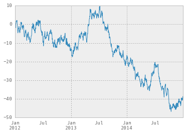


```python
s.cum
```


    <class 'pandas.tseries.index.DatetimeIndex'>
    [2012-01-01, ..., 2014-12-31]
    Length: 1096, Freq: D, Timezone: None


```python

```


```python
# tells pandas plots to use a default style
# which has a background fill
pd.options.display.mpl_style = 'default'
walk_ts.plot();
```


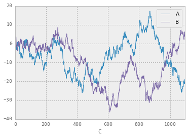


```python
# a DataFrame with a single column will produce
# the same plot as plotting the Series it is created from
walk_df = pd.DataFrame(walk_ts)
walk_df.plot(legend=False);
```


```python
# generate two random walks, one in each of
# two columns in a DataFrame
np.random.seed(seedval)
df = pd.DataFrame(np.random.randn(1096, 2),
                  index=walk_ts.index, columns=list('AB'))
walk_df = df.cumsum()
walk_df.head()
```


                       A         B
    2012-01-01 -1.878324  1.362367
    2012-01-02 -2.804186  1.427261
    2012-01-03 -3.241758  3.165368
    2012-01-04 -2.750550  3.332685
    2012-01-05 -1.620667  2.930017


```python
# plot the DataFrame, which will plot a line
# for each column, with a legend
walk_df.plot();
```


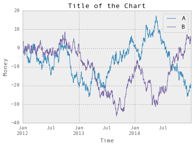


```python
# copy the walk
df2 = walk_df.copy()
# add a column C which is 0 .. 1096
df2['C'] = pd.Series(np.arange(0, len(df2)), index=df2.index)
# instead of dates on the x-axis, use the 'C' column,
# which will label the axis with 0..1000
df2.plot(x='C', y=['A', 'B']);
```


### Adorning and styling your time-series plot

* Adding a title and changing axes labels


```python
# create a time-series chart with a title and specific
# x and y axis labels

# title is set in the .plot() method as a parameter
walk_df.plot(title='Title of the Chart')
# explicitly set the x and y axes labels after the .plot()
plt.xlabel('Time')
plt.ylabel('Money');
```


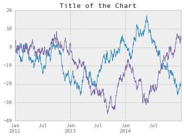


* Specifying the legend content and position


```python
# change the legend items to be different
# from the names of the columns in the DataFrame
ax = walk_df.plot(title='Title of the Chart')
# this sets the legend labels
ax.legend(['1', '2']);
```


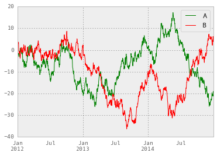


```python
# change the position of the legend
ax = walk_df.plot(title='Title of the Chart')
# put the legend in the upper center of the chart
ax.legend(['1', '2'], loc='upper center');
```


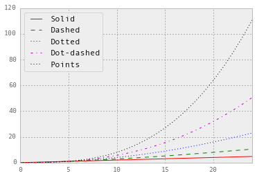


```python
# omit the legend by using legend=False
walk_df.plot(title='Title of the Chart', legend=False);
```


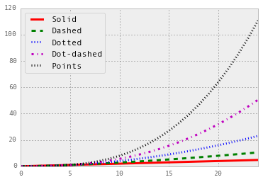


* Specifying line colors, styles, thickness, and markers


```python
# change the line colors on the plot
# use character code for the first line,
# hex RGB for the second
walk_df.plot(style=['g', '#FF0000']);
```


```python
# show off different line styles
t = np.arange(0., 5., 0.2)
legend_labels = ['Solid', 'Dashed', 'Dotted',
                 'Dot-dashed', 'Points']
line_style = pd.DataFrame({0 : t,
                           1 : t**1.5,
                           2 : t**2.0,
                           3 : t**2.5,
                           4 : t**3.0})
# generate the plot, specifying color and line style for each line
ax = line_style.plot(style=['r-', 'g--', 'b:', 'm-.', 'k:'])
# set the legend
ax.legend(legend_labels, loc='upper left');
```


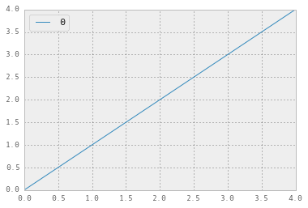


```python
# regenerate the plot, specifying color and line style
# for each line and a line width of 3 for all lines
ax = line_style.plot(style=['r-', 'g--', 'b:', 'm-.', 'k:'], lw=3)
ax.legend(legend_labels, loc='upper left');
```


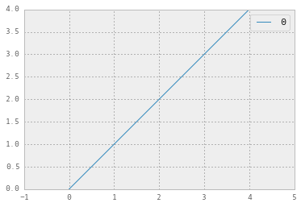


```python
# redraw, adding markers to the lines
ax = line_style.plot(style=['r-o', 'g--^', 'b:*',
                            'm-.D', 'k:o'], lw=3)
ax.legend(legend_labels, loc='upper left');
```


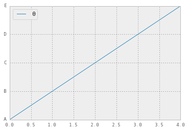


* Specifying tick mark locations and tick labels


```python
# a simple plot to use to examine ticks
ticks_data = pd.DataFrame(np.arange(0,5))
ticks_data.plot()
ticks, labels = plt.xticks()
ticks
```


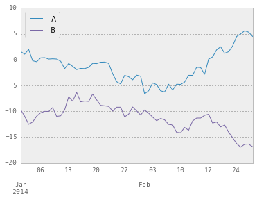


```python
# resize x-axis to (-1, 5), and draw ticks
# only at integer values
ticks_data = pd.DataFrame(np.arange(0,5))
ticks_data.plot()
plt.xticks(np.arange(-1, 6));
```


```python
# rename y-axis tick labels to A, B, C, D, and E
ticks_data = pd.DataFrame(np.arange(0,5))
ticks_data.plot()
plt.yticks(np.arange(0, 5), list("ABCDE"));
```


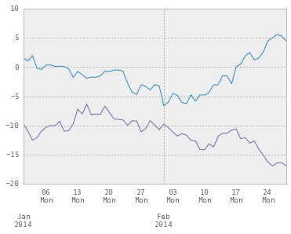


* Formatting axes tick date labels using formatters


```python
# plot January-February 2014 from the random walk
walk_df.loc['2014-01':'2014-02'].plot();
```


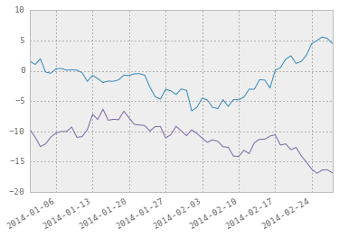


```python
# this import styles helps us type less
from matplotlib.dates import WeekdayLocator, \
DateFormatter, MonthLocator

# plot Jan-Feb 2014
ax = walk_df.loc['2014-01':'2014-02'].plot()

# do the minor labels
weekday_locator = WeekdayLocator(byweekday=(0), interval=1)
ax.xaxis.set_minor_locator(weekday_locator)
ax.xaxis.set_minor_formatter(DateFormatter("%d\n%a"))

# do the major labels
ax.xaxis.set_major_locator(MonthLocator())
ax.xaxis.set_major_formatter(DateFormatter('\n\n\n%b\n%Y'))
```


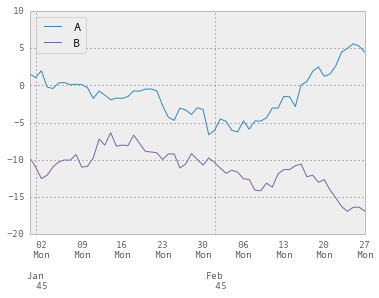


```python
# this gets around the pandas / matplotlib year issue
# need to reference the subset twice, so let's make a variable
walk_subset = walk_df['2014-01':'2014-02']

# this gets the plot so we can use it, we can ignore fig
fig, ax = plt.subplots()

# inform matplotlib that we will use the following as dates
# note we need to convert the index to a pydatetime series
ax.plot_date(walk_subset.index.to_pydatetime(), walk_subset, '-')

# do the minor labels
weekday_locator = WeekdayLocator(byweekday=(0), interval=1)
ax.xaxis.set_minor_locator(weekday_locator)
ax.xaxis.set_minor_formatter(DateFormatter('%d\n%a'))

# do the major labels
ax.xaxis.set_major_locator(MonthLocator())
ax.xaxis.set_major_formatter(DateFormatter('\n\n\n%b\n%Y'));
```


```python
# this gets the plot so we can use it, we can ignore fig
fig, ax = plt.subplots()

# inform matplotlib that we will use the following as dates
# note we need to convert the index to a pydatetime series
ax.plot_date(walk_subset.index.to_pydatetime(), walk_subset, '-')

# do the minor labels
weekday_locator = WeekdayLocator(byweekday=(0), interval=1)
ax.xaxis.set_minor_locator(weekday_locator)
ax.xaxis.set_minor_formatter(DateFormatter('%d\n%a'))
ax.xaxis.grid(True, "minor") # turn on minor tick grid lines
ax.xaxis.grid(False, "major") # turn off major tick grid lines

# do the major labels
ax.xaxis.set_major_locator(MonthLocator())
ax.xaxis.set_major_formatter(DateFormatter('\n\n\n%b\n%Y'));
```


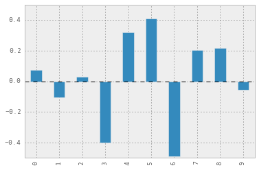


```python
# this gets the plot so we can use it, we can ignore fig
fig, ax = plt.subplots()

# inform matplotlib that we will use the following as dates
# note we need to convert the index to a pydatetime series
ax.plot_date(walk_subset.index.to_pydatetime(), walk_subset, '-')

ax.xaxis.grid(True, "major") # turn off major tick grid lines

# do the major labels
ax.xaxis.set_major_locator(weekday_locator)
ax.xaxis.set_major_formatter(DateFormatter('%Y-%m-%d'));

# informs to rotate date labels
fig.autofmt_xdate();
```


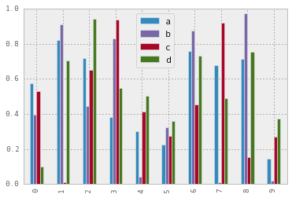


## 11.3 Common plots used in statistical analyses

### Bar plots


```python
# make a bar plot
# create a small series of 10 random values centered at 0.0
np.random.seed(seedval)
s = pd.Series(np.random.rand(10) - 0.5)
# plot the bar chart
s.plot(kind='bar');
```


```python
# draw a multiple series bar chart
# generate 4 columns of 10 random values
np.random.seed(seedval)
df2 = pd.DataFrame(np.random.rand(10, 4),
                   columns=['a', 'b', 'c', 'd'])
# draw the multi-series bar chart
df2.plot(kind='bar');
```


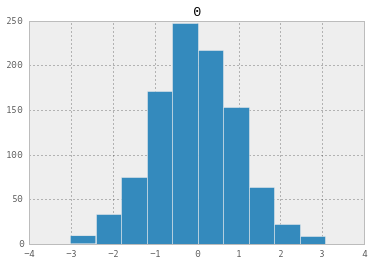


```python
# horizontal stacked bar chart
df2.plot(kind='bar', stacked=True);
```


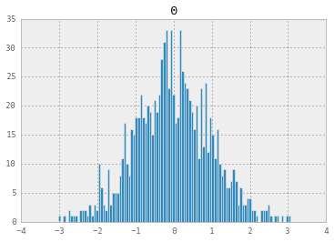


```python
# horizontal stacked bar chart
df2.plot(kind='barh', stacked=True);
```


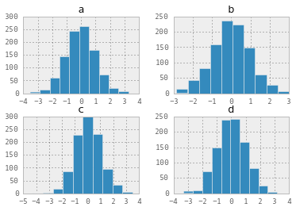


### Histograms


```python
# create a histogram
np.random.seed(seedval)
# 1000 random numbers
dfh = pd.DataFrame(np.random.randn(1000))
# draw the histogram
dfh.hist();
```


```python
# histogram again, but with more bins
dfh.hist(bins = 100);
```


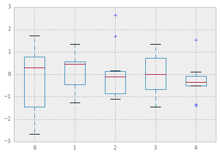


```python
# generate multiple histogram plot
# create data frame with 4 columns of 1000 random values
np.random.seed(seedval)
dfh = pd.DataFrame(np.random.randn(1000, 4),
                   columns=['a', 'b', 'c', 'd'])
# draw the chart.  There are four columns so pandas draws
# four historgrams
dfh.hist();
```


```python
# directly use pyplot to overlay multiple histograms
# generate two distributions, each with a different
# mean and standard deviation
np.random.seed(seedval)
x = [np.random.normal(3,1) for _ in range(400)]
y = [np.random.normal(4,2) for _ in range(400)]

# specify the bins (-10 to 10 with 100 bins)
bins = np.linspace(-10, 10, 100)

# generate plot x using plt.hist, 50% transparent
plt.hist(x, bins, alpha=0.5, label='x')
# generate plot y using plt.hist, 50% transparent
plt.hist(y, bins, alpha=0.5, label='y')
plt.legend(loc='upper right');
```


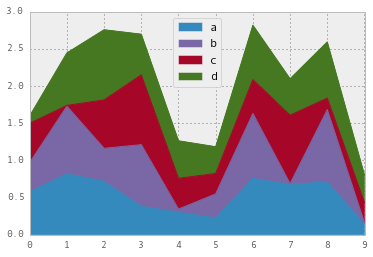


### Box and whisker charts


```python
# create a box plot
# generate the series
np.random.seed(seedval)
dfb = pd.DataFrame(np.random.randn(10,5))
# generate the plot
dfb.boxplot(return_type='axes');
```


### Area plots


```python
# create a stacked area plot
# generate a 4-column data frame of random data
np.random.seed(seedval)
dfa = pd.DataFrame(np.random.rand(10, 4),
                   columns=['a', 'b', 'c', 'd'])
# create the area plot
dfa.plot(kind='area');
```


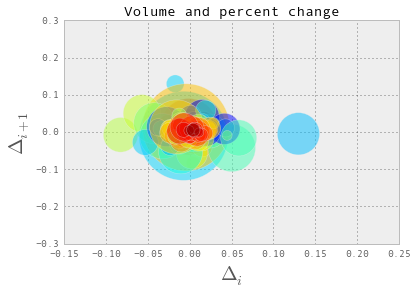


```python
# do not stack the area plot
dfa.plot(kind='area', stacked=False);
```


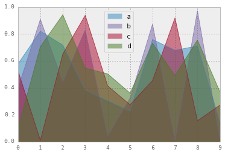


### Scatter plots


```python
# generate a scatter plot of two series of normally
# distributed random values
# we would expect this to cluster around 0,0
np.random.seed(111111)
sp_df = pd.DataFrame(np.random.randn(10000, 2),
                     columns=['a', 'b'])
sp_df.plot(kind='scatter', x='a', y='b');
```


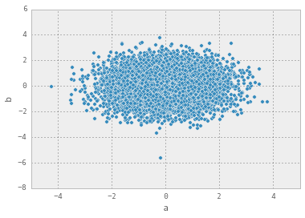


```python
# get Google stock data from 1/1/2011 to 12/31/2011
from pandas.io.data import DataReader
stock_data = DataReader("GOOGL", "yahoo",
                        datetime(2011, 1, 1),
                        datetime(2011, 12, 31))

# % change per day
delta = np.diff(stock_data["Adj Close"])/stock_data["Adj Close"][:-1]

# this calculates size of markers
volume = (15 * stock_data.Volume[:-2] / stock_data.Volume[0])**2
close = 0.003 * stock_data.Close[:-2] / 0.003 * stock_data.Open[:-2]

# generate scatter plot
fig, ax = plt.subplots()
ax.scatter(delta[:-1], delta[1:], c=close, s=volume, alpha=0.5)

# add some labels and style
ax.set_xlabel(r'$\Delta_i$', fontsize=20)
ax.set_ylabel(r'$\Delta_{i+1}$', fontsize=20)
ax.set_title('Volume and percent change')
ax.grid(True);
```


### Density plot


```python
# create a kde densitiy plot
# generate a series of 1000 random numbers
np.random.seed(seedval)
s = pd.Series(np.random.randn(1000))
# generate the plot
s.hist(normed=True) # shows the bars
s.plot(kind='kde', figsize=(10,8));
```


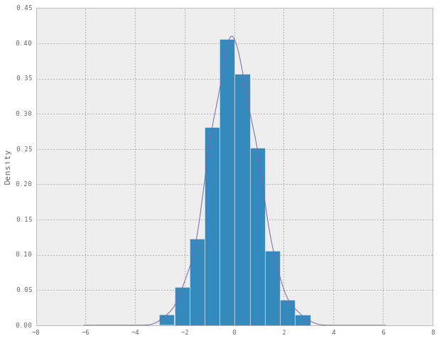


### The scatter plot matrix


```python
# create a scatter plot matrix
# import this class
from pandas.tools.plotting import scatter_matrix

# generate DataFrame with 4 columns of 1000 random numbers
np.random.seed(111111)
df_spm = pd.DataFrame(np.random.randn(1000, 4),
                      columns=['a', 'b', 'c', 'd'])
# create the scatter matrix
scatter_matrix(df_spm, alpha=0.2, figsize=(6, 6), diagonal='kde');
```


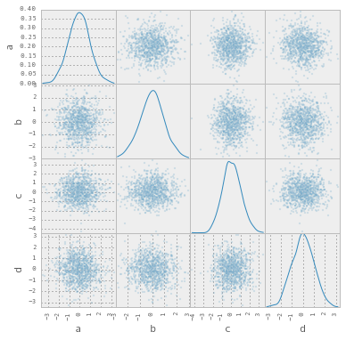


### Heatmaps


```python
# create a heatmap
# start with data for the heatmap
s = pd.Series([0.0, 0.1, 0.2, 0.3, 0.4],
              ['V', 'W', 'X', 'Y', 'Z'])
heatmap_data = pd.DataFrame({'A' : s + 0.0,
                             'B' : s + 0.1,
                             'C' : s + 0.2,
                             'D' : s + 0.3,
                             'E' : s + 0.4,
                             'F' : s + 0.5,
                             'G' : s + 0.6
                     })
heatmap_data
```


         A    B    C    D    E    F    G
    V  0.0  0.1  0.2  0.3  0.4  0.5  0.6
    W  0.1  0.2  0.3  0.4  0.5  0.6  0.7
    X  0.2  0.3  0.4  0.5  0.6  0.7  0.8
    Y  0.3  0.4  0.5  0.6  0.7  0.8  0.9
    Z  0.4  0.5  0.6  0.7  0.8  0.9  1.0


```python
# generate the heatmap
plt.imshow(heatmap_data, cmap='hot', interpolation='none')
plt.colorbar()  # add the scale of colors bar
# set the labels
plt.xticks(range(len(heatmap_data.columns)), heatmap_data.columns)
plt.yticks(range(len(heatmap_data)), heatmap_data.index);
```


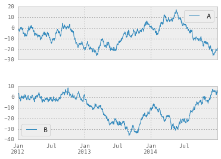


## 11.4 Multiple plots in a single chart


```python
# create two sub plots on the new plot using a 2x1 grid
# ax1 is the upper row
ax1 = plt.subplot2grid(shape=(2,1), loc=(0,0))
# and ax2 is in the lower row
ax2 = plt.subplot2grid(shape=(2,1), loc=(1,0))
```


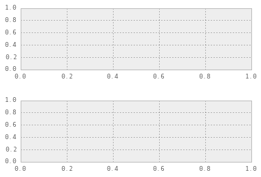


```python
# layout sub plots on a 4x4 grid
# ax1 on top row, 4 columns wide
ax1 = plt.subplot2grid((4,4), (0,0), colspan=4)
# ax2 is row 2, leftmost and 2 columns wide
ax2 = plt.subplot2grid((4,4), (1,0), colspan=2)
# ax3 is 2 cols wide and 2 rows high, starting
# on second row and the third column
ax3 = plt.subplot2grid((4,4), (1,2), colspan=2, rowspan=2)
# ax4 1 high 1 wide, in row 4 column 0
ax4 = plt.subplot2grid((4,4), (2,0))
# ax4 1 high 1 wide, in row 4 column 1
ax5 = plt.subplot2grid((4,4), (2,1));
```


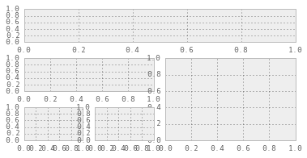


```python
# demonstrating drawing into specific sub-plots
# generate a layout of 2 rows 1 column
# create the subplots, one on each row
ax5 = plt.subplot2grid((2,1), (0,0))
ax6 = plt.subplot2grid((2,1), (1,0))
# plot column 0 of walk_df into top row of the grid
walk_df[[0]].plot(ax = ax5)
# and column 1 of walk_df into bottom row
walk_df[[1]].plot(ax = ax6);
```


```python
# draw the close on the top chart
top = plt.subplot2grid((4,4), (0, 0), rowspan=3, colspan=4)
top.plot(stock_data.index, stock_data['Close'], label='Close')
plt.title('Google Opening Stock Price 2001')

# draw the volume chart on the bottom
bottom = plt.subplot2grid((4,4), (3,0), rowspan=1, colspan=4)
bottom.bar(stock_data.index, stock_data['Volume'])
plt.title('Google Trading Volume')

# set the size of the plot
plt.gcf().set_size_inches(15,8)
```


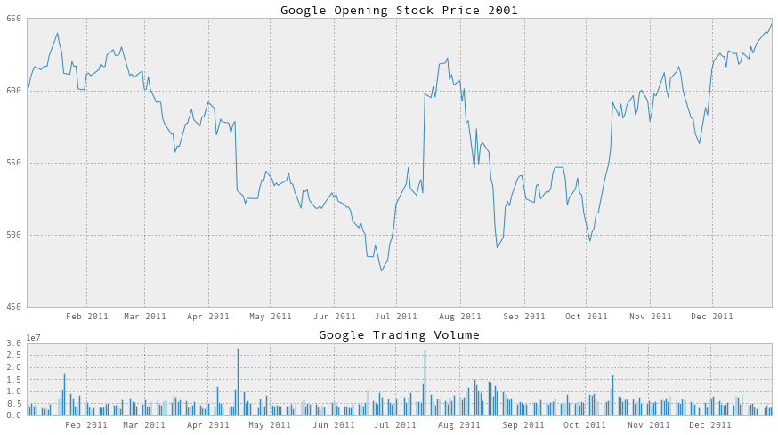


## 11.5 Summary


```python

```
