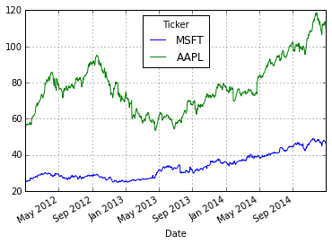

<!-- toc orderedList:0 depthFrom:1 depthTo:6 -->

- [Setting up the notebook](#setting-up-the-notebook)
- [Obtaining and organizing stock data from Yahoo!](#obtaining-and-organizing-stock-data-from-yahoo)
	- [Plotting time-series prices](#plotting-time-series-prices)
	- [Plotting volume series data](#plotting-volume-series-data)
	- [Calculating simple daily percentage change](#calculating-simple-daily-percentage-change)
	- [Calculating simple daily cumulative returns](#calculating-simple-daily-cumulative-returns)
	- [Resampling data from daily to monthly returns](#resampling-data-from-daily-to-monthly-returns)
	- [Analyzing distribution of returns](#analyzing-distribution-of-returns)
	- [Performing moving average calculation](#performing-moving-average-calculation)
	- [Comparision of average daily returns across stocks](#comparision-of-average-daily-returns-across-stocks)
	- [Correlation of stocks based upon daily percentage change of closing price](#correlation-of-stocks-based-upon-daily-percentage-change-of-closing-price)
- [Volatility](#volatility)
- [Determining risk relative to expected returns](#determining-risk-relative-to-expected-returns)

<!-- tocstop -->


# Setting up the notebook


```
# necessary imports for the workbook
import pandas as pd
import pandas.io.data
import numpy as np
import datetime
import matplotlib.pyplot as plt

# Set some pandas options
pd.set_option('display.notebook_repr_html', False)
pd.set_option('display.max_columns', 6)
pd.set_option('display.max_rows', 10)
pd.set_option('display.width', 78)
pd.set_option('precision', 4)

# do all our graphics inline
%matplotlib inline
```

# Obtaining and organizing stock data from Yahoo!


```
# read data from Yahoo! Finance for a specific
# stock specified by ticker and between the start and end dates
def getStockData(ticker, start, end):
    # read the data
    data = pd.io.data.DataReader(ticker, "yahoo", start, end)
    # rename this column
    data.rename(columns={'Adj Close': 'AdjClose'}, inplace=True)
    # insert in the ticker as a column
    data.insert(0, "Ticker", ticker)
    return data
```


```
# request the three years of data for MSFT
start = datetime.datetime(2012, 1, 1)
end = datetime.datetime(2014, 12, 31)
getStockData("MSFT", start, end).head()
```


               Ticker   Open   High    ...     Close    Volume  AdjClose
    Date                               ...                              
    2012-01-03   MSFT  26.55  26.96    ...     26.77  64731500     24.42
    2012-01-04   MSFT  26.82  27.47    ...     27.40  80516100     25.00
    2012-01-05   MSFT  27.38  27.73    ...     27.68  56081400     25.25
    2012-01-06   MSFT  27.53  28.19    ...     28.11  99455500     25.64
    2012-01-09   MSFT  28.05  28.10    ...     27.74  59706800     25.31

    [5 rows x 7 columns]


```
# gets data for multiple stocks
# tickers: a list of stock symbols to fetch
# start and end are the start end end dates
def getDataForMultipleStocks(tickers, start, end):
    # we return a dictionary
    stocks = dict()
    # loop through all the tickers
    for ticker in tickers:
        # get the data for the specific ticker
        s = getStockData(ticker, start, end)
        # add it to the dictionary
        stocks[ticker] = s
    # return the dictionary
    return stocks
```


```
# get the data for all the stocks that we want
raw = getDataForMultipleStocks(
    ["MSFT", "AAPL", "GE", "IBM", "AA", "DAL",
     "UAL", "PEP", "KO"],
    start, end)
```


```
# take a peek at the data for MSFT
raw['MSFT'][:5]
```


               Ticker   Open   High    ...     Close    Volume  AdjClose
    Date                               ...                              
    2012-01-03   MSFT  26.55  26.96    ...     26.77  64731500     24.42
    2012-01-04   MSFT  26.82  27.47    ...     27.40  80516100     25.00
    2012-01-05   MSFT  27.38  27.73    ...     27.68  56081400     25.25
    2012-01-06   MSFT  27.53  28.19    ...     28.11  99455500     25.64
    2012-01-09   MSFT  28.05  28.10    ...     27.74  59706800     25.31

    [5 rows x 7 columns]


```
# given the dictionary of data frames,
# pivots a given column into values with column
# names being the stock symbols
def pivotTickersToColumns(raw, column):
    items = []
    # loop through all dictionary keys
    for key in raw:
        # get the data for the key
        data = raw[key]
        # extract just the column specified
        subset = data[["Ticker", column]]
        # add to items
        items.append(subset)

    # concatenate all the items
    combined = pd.concat(items)
    # reset the index
    ri = combined.reset_index()
    # return the pivot
    return ri.pivot("Date", "Ticker", column)
```


```
# do the pivot
close_px = pivotTickersToColumns(raw, "AdjClose")
# peek at the result
close_px[:5]
```


    Ticker        AA   AAPL   DAL  ...     MSFT    PEP    UAL
    Date                           ...                       
    2012-01-03  8.89  55.41  7.92  ...    24.42  60.44  18.90
    2012-01-04  9.10  55.71  7.89  ...    25.00  60.75  18.52
    2012-01-05  9.02  56.33  8.20  ...    25.25  60.28  18.39
    2012-01-06  8.83  56.92  8.19  ...    25.64  59.52  18.21
    2012-01-09  9.09  56.83  8.15  ...    25.31  59.83  17.93

    [5 rows x 9 columns]


## Plotting time-series prices


```
# plot the closing prices of AAPL
close_px['AAPL'].plot();
```


```
# plot the closing prices of MSFT
close_px['MSFT'].plot();
```


```
# plot MSFT vs AAPL on the same chart
close_px[['MSFT', 'AAPL']].plot();
```





## Plotting volume series data


```
# pivot the volume data into columns
volumes = pivotTickersToColumns(raw, "Volume")
volumes.tail()
```


    Ticker           AA      AAPL      DAL   ...         MSFT      PEP      UAL
    Date                                     ...                               
    2014-12-24  4944200  14479600  4296200   ...     11437800  1604100  2714300
    2014-12-26  6355200  33721000  5303100   ...     13197800  1492700  3062200
    2014-12-29  7087800  27598900  6656700   ...     14439500  2453800  2874300
    2014-12-30  9262100  29881500  7318900   ...     16384700  2134400  2644600
    2014-12-31  8842400  41403400  7801700   ...     21552500  3727400  4451200

    [5 rows x 9 columns]


```
# plot the volume for MSFT
msftV = volumes[["MSFT"]]
plt.bar(msftV.index, msftV["MSFT"])
plt.gcf().set_size_inches(15,8)
```


```
# draw the price history on the top
top = plt.subplot2grid((4,4), (0, 0), rowspan=3, colspan=4)
top.plot(close_px['MSFT'].index, close_px['MSFT'], label='MSFT Adjusted Close')
plt.title('Microsoft Ajusted Close Price 2012 - 2014')
plt.legend(loc=2)

# and the volume along the bottom
bottom = plt.subplot2grid((4,4), (3,0), rowspan=1, colspan=4)
bottom.bar(msftV.index, msftV['MSFT'])
plt.title('Microsoft Trading Volume 2012 - 2014')
plt.subplots_adjust(hspace=0.75)
plt.gcf().set_size_inches(15,8)
```


## Calculating simple daily percentage change


```
# calculate daily percentage change
daily_pc = close_px / close_px.shift(1) - 1
daily_pc[:5]
```


    Ticker         AA   AAPL    DAL  ...     MSFT    PEP    UAL
    Date                             ...                       
    2012-01-03    NaN    NaN    NaN  ...      NaN    NaN    NaN
    2012-01-04  0.024  0.005 -0.004  ...    0.024  0.005 -0.020
    2012-01-05 -0.009  0.011  0.039  ...    0.010 -0.008 -0.007
    2012-01-06 -0.021  0.010 -0.001  ...    0.015 -0.013 -0.010
    2012-01-09  0.029 -0.002 -0.005  ...   -0.013  0.005 -0.015

    [5 rows x 9 columns]


```
# check the percentage on 2012-01-05
close_px.ix['2012-01-05']['AAPL'] / close_px.ix['2012-01-04']['AAPL'] -1
```


    0.011129061209836699


```
# plot daily percentage change for AAPL
daily_pc["AAPL"].plot();
```


## Calculating simple daily cumulative returns


```
# calculate daily cumulative return
daily_cr = (1 + daily_pc).cumprod()
daily_cr[:5]
```


    Ticker         AA   AAPL    DAL  ...     MSFT    PEP    UAL
    Date                             ...                       
    2012-01-03    NaN    NaN    NaN  ...      NaN    NaN    NaN
    2012-01-04  1.024  1.005  0.996  ...    1.024  1.005  0.980
    2012-01-05  1.015  1.017  1.035  ...    1.034  0.997  0.973
    2012-01-06  0.993  1.027  1.034  ...    1.050  0.985  0.963
    2012-01-09  1.022  1.026  1.029  ...    1.036  0.990  0.949

    [5 rows x 9 columns]


```
# plot all the cumulative returns to get an idea
# of the relative performance of all the stocks
daily_cr.plot(figsize=(8,6))
plt.legend(loc=2);
```


## Resampling data from daily to monthly returns


```
# resample to end of month and forward fill values
monthly = close_px.asfreq('EOM', method="ffill")
monthly[:5]
```


    Ticker        AA   AAPL    DAL  ...     MSFT    PEP    UAL
    2012-01-31  9.79  61.51  10.39  ...    26.94  59.78  23.10
    2012-02-29  9.83  73.09   9.66  ...    29.15  57.76  20.65
    2012-03-30  9.68  80.79   9.77  ...    29.62  60.89  21.50
    2012-04-30  9.40  78.69  10.79  ...    29.40  60.57  21.92
    2012-05-31  8.29  77.85  11.92  ...    26.98  62.76  25.17

    [5 rows x 9 columns]


```
# calculate the monthly percentage changes
monthly_pc = monthly / monthly.shift(1) - 1
monthly_pc[:5]
```


    Ticker         AA   AAPL    DAL  ...     MSFT    PEP    UAL
    2012-01-31    NaN    NaN    NaN  ...      NaN    NaN    NaN
    2012-02-29  0.004  0.188 -0.070  ...    0.082 -0.034 -0.106
    2012-03-30 -0.015  0.105  0.011  ...    0.016  0.054  0.041
    2012-04-30 -0.029 -0.026  0.104  ...   -0.007 -0.005  0.020
    2012-05-31 -0.118 -0.011  0.105  ...   -0.082  0.036  0.148

    [5 rows x 9 columns]


```
# calculate monthly cumulative return
monthly_cr = (1 + monthly_pc).cumprod()
monthly_cr[:5]
```


    Ticker         AA   AAPL    DAL  ...     MSFT    PEP    UAL
    2012-01-31    NaN    NaN    NaN  ...      NaN    NaN    NaN
    2012-02-29  1.004  1.188  0.930  ...    1.082  0.966  0.894
    2012-03-30  0.989  1.313  0.940  ...    1.099  1.019  0.931
    2012-04-30  0.960  1.279  1.038  ...    1.091  1.013  0.949
    2012-05-31  0.847  1.266  1.147  ...    1.001  1.050  1.090

    [5 rows x 9 columns]


```
# plot the monthly cumulative returns
monthly_cr.plot(figsize=(12,6))
plt.legend(loc=2);
```


## Analyzing distribution of returns


```
# histogram of the daily percentage change for AAPL
aapl = daily_pc['AAPL']
aapl.hist(bins=50);
```


```
# descriptive statistics of the percentage changes
aapl.describe()
```


    count    753.000
    mean       0.001
    std        0.017
    min       -0.124
    25%       -0.007
    50%        0.001
    75%        0.011
    max        0.089
    Name: AAPL, dtype: float64


```
# matrix of all stocks daily % changes histograms
daily_pc.hist(bins=50, figsize=(8,6));
```


## Performing moving average calculation


```
# extract just MSFT close
msft_close = close_px[['MSFT']]['MSFT']
# calculate the 30 and 90 day rolling means
ma_30 = pd.stats.moments.rolling_mean(msft_close, 30)
ma_90 = pd.stats.moments.rolling_mean(msft_close, 90)
# compose into a DataFrame that can be plotted
result = pd.DataFrame({'Close': msft_close,
                       '30_MA_Close': ma_30,
                       '90_MA_Close': ma_90})
# plot all the series against each other
result.plot(title="MSFT Close Price")
plt.gcf().set_size_inches(12,8)
```


## Comparision of average daily returns across stocks


```
# plot the daily percentage change of MSFT vs AAPL
plt.scatter(daily_pc['MSFT'], daily_pc['AAPL'])
plt.xlabel('MSFT')
plt.ylabel('AAPL');
```


```
# demonstrate perfect correlation
plt.scatter(daily_pc['MSFT'], daily_pc['MSFT']);
```


```
# plot the scatter of daily price changed for ALL stocks
pd.scatter_matrix(daily_pc, diagonal='kde', figsize=(12,12));
```


## Correlation of stocks based upon daily percentage change of closing price


```
# calculate the correlation between all the stocks relative
# to daily percentage change
corrs = daily_pc.corr()
corrs
```


    Ticker     AA   AAPL    DAL  ...     MSFT    PEP    UAL
    Ticker                       ...                       
    AA      1.000  0.236  0.251  ...    0.310  0.227  0.223
    AAPL    0.236  1.000  0.135  ...    0.187  0.092  0.062
    DAL     0.251  0.135  1.000  ...    0.149  0.174  0.761
    GE      0.458  0.239  0.317  ...    0.341  0.381  0.237
    IBM     0.311  0.212  0.168  ...    0.356  0.258  0.124
    KO      0.228  0.161  0.186  ...    0.271  0.557  0.139
    MSFT    0.310  0.187  0.149  ...    1.000  0.284  0.127
    PEP     0.227  0.092  0.174  ...    0.284  1.000  0.130
    UAL     0.223  0.062  0.761  ...    0.127  0.130  1.000

    [9 rows x 9 columns]


```
# plot a heatmap of the correlations
plt.imshow(corrs, cmap='hot', interpolation='none')
plt.colorbar()
plt.xticks(range(len(corrs)), corrs.columns)
plt.yticks(range(len(corrs)), corrs.columns)
plt.gcf().set_size_inches(8,8)
```


# Volatility


```
# 75 period minimum
min_periods = 75
# calculate the volatility
vol = pd.stats.moments.rolling_std(daily_pc, min_periods) * \
        np.sqrt(min_periods)
# plot it
vol.plot(figsize=(10, 8));
```


# Determining risk relative to expected returns


```
# generate a scatter of the mean vs std of daily % change
plt.scatter(daily_pc.mean(), daily_pc.std())
plt.xlabel('Expected returns')
plt.ylabel('Risk')

# this adds fancy labels to each dot, with an arrow too
for label, x, y in zip(daily_pc.columns,
                       daily_pc.mean(),
                       daily_pc.std()):
    plt.annotate(
        label,
        xy = (x, y), xytext = (30, -30),
        textcoords = 'offset points', ha = 'right', va = 'bottom',
        bbox = dict(boxstyle = 'round,pad=0.5',
                    fc = 'yellow',
                    alpha = 0.5),
        arrowprops = dict(arrowstyle = '->',
                          connectionstyle = 'arc3,rad=0'))

# set ranges and scales for good presentation
plt.xlim(-0.001, 0.003)
plt.ylim(0.005, 0.0275)

# set size
plt.gcf().set_size_inches(8,8)
```


