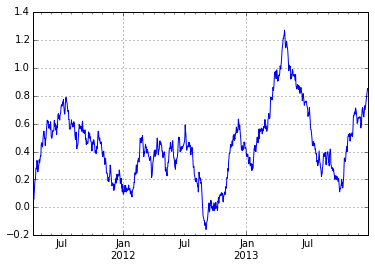
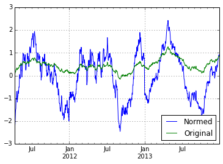

<!-- toc orderedList:0 depthFrom:1 depthTo:6 -->

- [Setting up the notebook](#setting-up-the-notebook)
- [Splitting a pandas object](#splitting-a-pandas-object)
	- [Data for the examples](#data-for-the-examples)
	- [Grouping by a column values](#grouping-by-a-column-values)
	- [Accessing the results of a grouping](#accessing-the-results-of-a-grouping)
	- [Grouping using index levels](#grouping-using-index-levels)
- [Apply (aggregation)](#apply-aggregation)
	- [Applying aggregation functions to groups](#applying-aggregation-functions-to-groups)
	- [Transformation of group data](#transformation-of-group-data)
		- [Overview of transformations](#overview-of-transformations)
		- [Practical examples of transformation](#practical-examples-of-transformation)
	- [Filtering groups](#filtering-groups)
- [Discretization](#discretization)

<!-- tocstop -->


# Setting up the notebook
{python}

```
# import pandas and numpy
import numpy as np
import pandas as pd

# Set some pandas options for controlling output
pd.set_option('display.notebook_repr_html', False)
pd.set_option('display.max_columns', 10)
pd.set_option('display.max_rows', 10)

import matplotlib.pyplot as plt
# inline graphics
%matplotlib inline
```

# Splitting a pandas object

## Data for the examples


```{python}
# load the sensors data
sensors = pd.read_csv("data/sensors.csv")
sensors
```


        interval       sensor axis  reading
    0          0        accel    Z      0.0
    1          0        accel    Y      0.5
    2          0        accel    X      1.0
    3          1        accel    Z      0.1
    4          1        accel    Y      0.4
    ..       ...          ...  ...      ...
    19         2  orientation    Y      0.3
    20         2  orientation    X      0.2
    21         3  orientation    Z      0.0
    22         3  orientation    Y      0.4
    23         3  orientation    X      0.3

    [24 rows x 4 columns]


## Grouping by a column values


```{python}
# group this data by the sensor column / variable
# returns a DataFrameGroupBy object
grouped = sensors.groupby('sensor')
grouped
```


    <pandas.core.groupby.DataFrameGroupBy object at 0x1067a07d0>


```{python}
# get the number of groups that this will create
grouped.ngroups
```


    2


```{python}
# what are the groups that were found?
grouped.groups
```


    {'accel': [0, 1, 2, 3, 4, 5, 6, 7, 8, 9, 10, 11],
     'orientation': [12, 13, 14, 15, 16, 17, 18, 19, 20, 21, 22, 23]}


## Accessing the results of a grouping


```{python}
# a helper function to print the contents of the groups
def print_groups (groupobject):
    # loop over all groups, printing the group name
    # and group details
    for name, group in groupobject:
        print (name)
        print (group)
```


```{python}
# examine the content of the groups we created
print_groups(grouped)
```

    accel
        interval sensor axis  reading
    0          0  accel    Z      0.0
    1          0  accel    Y      0.5
    2          0  accel    X      1.0
    3          1  accel    Z      0.1
    4          1  accel    Y      0.4
    ..       ...    ...  ...      ...
    7          2  accel    Y      0.3
    8          2  accel    X      0.8
    9          3  accel    Z      0.3
    10         3  accel    Y      0.2
    11         3  accel    X      0.7

    [12 rows x 4 columns]
    orientation
        interval       sensor axis  reading
    12         0  orientation    Z      0.0
    13         0  orientation    Y      0.1
    14         0  orientation    X      0.0
    15         1  orientation    Z      0.0
    16         1  orientation    Y      0.2
    ..       ...          ...  ...      ...
    19         2  orientation    Y      0.3
    20         2  orientation    X      0.2
    21         3  orientation    Z      0.0
    22         3  orientation    Y      0.4
    23         3  orientation    X      0.3

    [12 rows x 4 columns]


```{python}
# get how many items are in each group
grouped.size()
```


    sensor
    accel          12
    orientation    12
    dtype: int64


```{python}
# get the count of items in each column of each group
grouped.count()
```


                 interval  axis  reading
    sensor                              
    accel              12    12       12
    orientation        12    12       12


```{python}
# get the data in one specific group
grouped.get_group('accel')
```


        interval sensor axis  reading
    0          0  accel    Z      0.0
    1          0  accel    Y      0.5
    2          0  accel    X      1.0
    3          1  accel    Z      0.1
    4          1  accel    Y      0.4
    ..       ...    ...  ...      ...
    7          2  accel    Y      0.3
    8          2  accel    X      0.8
    9          3  accel    Z      0.3
    10         3  accel    Y      0.2
    11         3  accel    X      0.7

    [12 rows x 4 columns]


```{python}
# get the first three items in each group
grouped.head(3)
```


        interval       sensor axis  reading
    0          0        accel    Z      0.0
    1          0        accel    Y      0.5
    2          0        accel    X      1.0
    12         0  orientation    Z      0.0
    13         0  orientation    Y      0.1
    14         0  orientation    X      0.0


```{python}
# get the first item in each group
grouped.nth(0)
```


                 interval       sensor axis  reading
    sensor                                          
    accel               0        accel    Z        0
    orientation         0  orientation    Z        0


```{python}
# get the 2nd item in each group
grouped.nth(1)
```


                 interval       sensor axis  reading
    sensor                                          
    accel               0        accel    Y      0.5
    orientation         0  orientation    Y      0.1


```{python}
# and so on...
grouped.nth(2)
```


                 interval       sensor axis  reading
    sensor                                          
    accel               0        accel    X        1
    orientation         0  orientation    X        0


```{python}
# group by both sensor and axis values
mcg = sensors.groupby(['sensor', 'axis'])
print_groups(mcg)
```

    ('accel', 'X')
        interval sensor axis  reading
    2          0  accel    X      1.0
    5          1  accel    X      0.9
    8          2  accel    X      0.8
    11         3  accel    X      0.7
    ('accel', 'Y')
        interval sensor axis  reading
    1          0  accel    Y      0.5
    4          1  accel    Y      0.4
    7          2  accel    Y      0.3
    10         3  accel    Y      0.2
    ('accel', 'Z')
       interval sensor axis  reading
    0         0  accel    Z      0.0
    3         1  accel    Z      0.1
    6         2  accel    Z      0.2
    9         3  accel    Z      0.3
    ('orientation', 'X')
        interval       sensor axis  reading
    14         0  orientation    X      0.0
    17         1  orientation    X      0.1
    20         2  orientation    X      0.2
    23         3  orientation    X      0.3
    ('orientation', 'Y')
        interval       sensor axis  reading
    13         0  orientation    Y      0.1
    16         1  orientation    Y      0.2
    19         2  orientation    Y      0.3
    22         3  orientation    Y      0.4
    ('orientation', 'Z')
        interval       sensor axis  reading
    12         0  orientation    Z        0
    15         1  orientation    Z        0
    18         2  orientation    Z        0
    21         3  orientation    Z        0


```{python}
# get descriptive statistics for each
mcg.describe()
```


                            interval   reading
    sensor      axis                          
    accel       X    count  4.000000  4.000000
                     mean   1.500000  0.850000
                     std    1.290994  0.129099
                     min    0.000000  0.700000
                     25%    0.750000  0.775000
    ...                          ...       ...
    orientation Z    min    0.000000  0.000000
                     25%    0.750000  0.000000
                     50%    1.500000  0.000000
                     75%    2.250000  0.000000
                     max    3.000000  0.000000

    [48 rows x 2 columns]


## Grouping using index levels


```{python}
# make a copy of the data and reindex the copy
mi = sensors.copy()
mi = mi.set_index(['sensor', 'axis'])
mi
```


                      interval  reading
    sensor      axis                   
    accel       Z            0      0.0
                Y            0      0.5
                X            0      1.0
                Z            1      0.1
                Y            1      0.4
    ...                    ...      ...
    orientation Y            2      0.3
                X            2      0.2
                Z            3      0.0
                Y            3      0.4
                X            3      0.3

    [24 rows x 2 columns]


```{python}
# group by the first level of the index
mig_l1 = mi.groupby(level=0)
print_groups(mig_l1)
```

    accel
                 interval  reading
    sensor axis                   
    accel  Z            0      0.0
           Y            0      0.5
           X            0      1.0
           Z            1      0.1
           Y            1      0.4
    ...               ...      ...
           Y            2      0.3
           X            2      0.8
           Z            3      0.3
           Y            3      0.2
           X            3      0.7

    [12 rows x 2 columns]
    orientation
                      interval  reading
    sensor      axis                   
    orientation Z            0      0.0
                Y            0      0.1
                X            0      0.0
                Z            1      0.0
                Y            1      0.2
    ...                    ...      ...
                Y            2      0.3
                X            2      0.2
                Z            3      0.0
                Y            3      0.4
                X            3      0.3

    [12 rows x 2 columns]


```{python}
# group by multiple levels of the index
mig_l12 = mi.groupby(level=['sensor', 'axis'])
print_groups(mig_l12)
```

    ('accel', 'X')
                 interval  reading
    sensor axis                   
    accel  X            0      1.0
           X            1      0.9
           X            2      0.8
           X            3      0.7
    ('accel', 'Y')
                 interval  reading
    sensor axis                   
    accel  Y            0      0.5
           Y            1      0.4
           Y            2      0.3
           Y            3      0.2
    ('accel', 'Z')
                 interval  reading
    sensor axis                   
    accel  Z            0      0.0
           Z            1      0.1
           Z            2      0.2
           Z            3      0.3
    ('orientation', 'X')
                      interval  reading
    sensor      axis                   
    orientation X            0      0.0
                X            1      0.1
                X            2      0.2
                X            3      0.3
    ('orientation', 'Y')
                      interval  reading
    sensor      axis                   
    orientation Y            0      0.1
                Y            1      0.2
                Y            2      0.3
                Y            3      0.4
    ('orientation', 'Z')
                      interval  reading
    sensor      axis                   
    orientation Z            0        0
                Z            1        0
                Z            2        0
                Z            3        0


# Apply (aggregation)

## Applying aggregation functions to groups


```{python}
# calculate the mean for each sensor/axis
mig_l12.agg(np.mean)
```


                      interval  reading
    sensor      axis                   
    accel       X          1.5     0.85
                Y          1.5     0.35
                Z          1.5     0.15
    orientation X          1.5     0.15
                Y          1.5     0.25
                Z          1.5     0.00


```{python}
# do not create an index matching the original object
sensors.groupby(['sensor', 'axis'],
                as_index=False).agg(np.mean)
```


            sensor axis  interval  reading
    0        accel    X       1.5     0.85
    1        accel    Y       1.5     0.35
    2        accel    Z       1.5     0.15
    3  orientation    X       1.5     0.15
    4  orientation    Y       1.5     0.25
    5  orientation    Z       1.5     0.00


```{python}
# can simply apply the agg function to the group by object
mig_l12.mean()
```


                      interval  reading
    sensor      axis                   
    accel       X          1.5     0.85
                Y          1.5     0.35
                Z          1.5     0.15
    orientation X          1.5     0.15
                Y          1.5     0.25
                Z          1.5     0.00


```{python}
# apply multiple aggregation functions at once
mig_l12.agg([np.sum, np.std])
```


                     interval           reading          
                          sum       std     sum       std
    sensor      axis                                     
    accel       X           6  1.290994     3.4  0.129099
                Y           6  1.290994     1.4  0.129099
                Z           6  1.290994     0.6  0.129099
    orientation X           6  1.290994     0.6  0.129099
                Y           6  1.290994     1.0  0.129099
                Z           6  1.290994     0.0  0.000000


```{python}
# apply a different function to each column
mig_l12.agg({'interval' : len,
             'reading': np.mean})
```


                      interval  reading
    sensor      axis                   
    accel       X            4     0.85
                Y            4     0.35
                Z            4     0.15
    orientation X            4     0.15
                Y            4     0.25
                Z            4     0.00


```{python}
# calculate the mean of the reading column
mig_l12['reading'].mean()
```


    sensor       axis
    accel        X       0.85
                 Y       0.35
                 Z       0.15
    orientation  X       0.15
                 Y       0.25
                 Z       0.00
    Name: reading, dtype: float64


## Transformation of group data

### Overview of transformations


```{python}
# a DataFrame to use for examples
df = pd.DataFrame({ 'Label': ['A', 'C', 'B', 'A', 'C'],
                    'Values': [0, 1, 2, 3, 4],
                    'Values2': [5, 6, 7, 8, 9],
                    'Noise': ['foo', 'bar', 'baz',
                              'foobar', 'barbaz']})
df
```


      Label   Noise  Values  Values2
    0     A     foo       0        5
    1     C     bar       1        6
    2     B     baz       2        7
    3     A  foobar       3        8
    4     C  barbaz       4        9


```{python}
# group by label
grouped = df.groupby('Label')
print_groups(grouped)
```

    A
      Label   Noise  Values  Values2
    0     A     foo       0        5
    3     A  foobar       3        8
    B
      Label Noise  Values  Values2
    2     B   baz       2        7
    C
      Label   Noise  Values  Values2
    1     C     bar       1        6
    4     C  barbaz       4        9


```{python}
# add ten to all values in all columns
grouped.transform(lambda x: x + 10)
```


       Values  Values2
    0      10       15
    1      11       16
    2      12       17
    3      13       18
    4      14       19


```{python}
# a function to print the input before we are adding 10 to it
def xplus10(x):
    print (x)
    return x + 10
```


```{python}
# transform using xplus10
grouped.transform(xplus10)
```

    0       foo
    3    foobar
    Name: Noise, dtype: object
    0       foo
    3    foobar
    Name: Noise, dtype: object
    0       foo
    3    foobar
    Name: A, dtype: object
    0    0
    3    3
    Name: A, dtype: int64
    2    2
    Name: B, dtype: int64
    1    1
    4    4
    Name: C, dtype: int64
    0    5
    3    8
    Name: A, dtype: int64
    2    7
    Name: B, dtype: int64
    1    6
    4    9
    Name: C, dtype: int64


       Values  Values2
    0      10       15
    1      11       16
    2      12       17
    3      13       18
    4      14       19


```{python}
# sum returns existing as it is applied to each individual item
grouped.transform(lambda x: x.sum())
```


        Noise  Values  Values2
    0     foo       0        5
    1     bar       1        6
    2     baz       2        7
    3  foobar       3        8
    4  barbaz       4        9


### Practical examples of transformation


```{python}
# data to demonstrate replacement on NaN
df = pd.DataFrame({ 'Label': list("ABABAB"),
                    'Values': [10, 20, 11, np.nan, 12, 22]},
                  index=['i1', 'i2', 'i3', 'i4', 'i5', 'i6'])
df
```


       Label  Values
    i1     A      10
    i2     B      20
    i3     A      11
    i4     B     NaN
    i5     A      12
    i6     B      22


```{python}
# show the groups in the data based upon Label
grouped = df.groupby('Label')
print_groups(grouped)
```

    A
       Label  Values
    i1     A      10
    i3     A      11
    i5     A      12
    B
       Label  Values
    i2     B      20
    i4     B     NaN
    i6     B      22


```{python}
# calculate the mean of the two groups
grouped.mean()
```


           Values
    Label        
    A          11
    B          21


```{python}
# use transform to fill the NaNs with the mean of the group
filled_NaNs = grouped.transform(lambda x: x.fillna(x.mean()))
filled_NaNs
```


        Values
    i1      10
    i2      20
    i3      11
    i4      21
    i5      12
    i6      22


```{python}
# overwrite old values with the new ones
df.Values = filled_NaNs
df
```


       Label  Values
    i1     A      10
    i2     B      20
    i3     A      11
    i4     B      21
    i5     A      12
    i6     B      22


```{python}
# generate a rolling mean time series
np.random.seed(123456)
data = pd.Series(np.random.normal(0.5, 2, 365*3),
                 pd.date_range('2011-01-01', periods=365*3))
rolling = pd.rolling_mean(data, 100, 100).dropna()
rolling
```


    2011-04-10    0.073603
    2011-04-11    0.057313
    2011-04-12    0.089255
    ...
    2013-12-28    0.850998
    2013-12-29    0.842293
    2013-12-30    0.848419
    Freq: D, Length: 996


```{python}
# visualize the series
rolling.plot();
```





```{python}
# calculate mean and std by year
groupkey = lambda x: x.year
groups = rolling.groupby(groupkey)
groups.agg([np.mean, np.std])
```


              mean       std
    2011  0.454233  0.171988
    2012  0.286874  0.181930
    2013  0.599933  0.276009


```{python}
# normalize to the z-score
zscore = lambda x: (x - x.mean()) / x.std()
normed = rolling.groupby(groupkey).transform(zscore)
normed.groupby(groupkey).agg([np.mean, np.std])
```


                  mean  std
    2011 -3.172066e-17    1
    2012  4.246755e-17    1
    2013 -3.388620e-16    1


```{python}
# plot original vs normalize
compared = pd.DataFrame({ 'Original': rolling,
                          'Normed': normed })
compared.plot();
```





```{python}
# check the distribution % within one std
# should be roughly 64.2%
normed_in1std = normed[np.abs(normed) <= 1.0].count()
float(normed_in1std) / len(normed)
```


    0.6485943775100401


## Filtering groups


```{python}
# data for our examples
df = pd.DataFrame({'Label': list('AABCCC'),
                   'Values': [1, 2, 3, 4, np.nan, 8]})
df
```


      Label  Values
    0     A       1
    1     A       2
    2     B       3
    3     C       4
    4     C     NaN
    5     C       8


```{python}
# drop groups with one or fewer non-NaN values
f = lambda x: x.Values.count() > 1
df.groupby('Label').filter(f)
```


      Label  Values
    0     A       1
    1     A       2
    3     C       4
    4     C     NaN
    5     C       8


```{python}
# drop any groups with NaN values
f = lambda x: x.Values.isnull().sum() == 0
df.groupby('Label').filter(f)
```


      Label  Values
    0     A       1
    1     A       2
    2     B       3


```{python}
# select groups with a mean of 2.0 or greater
grouped = df.groupby('Label')
mean = grouped.mean().mean()
f = lambda x: abs(x.Values.mean() - mean) > 2.0
df.groupby('Label').filter(f)
```


      Label  Values
    3     C       4
    4     C     NaN
    5     C       8


```{python}
# replace values in a group where the # of items is <= 1
f = lambda x: x.Values.count() > 1
df.groupby('Label').filter(f, dropna=False)
```


      Label  Values
    0     A       1
    1     A       2
    2   NaN     NaN
    3     C       4
    4     C     NaN
    5     C       8


# Discretization


```{python}
# generate 10000 normal random #'s
np.random.seed(123456)
dist = np.random.normal(size = 10000)

# show the mean and std
"{0} {1}".format(dist.mean(), dist.std())
```


    '-0.00286332404091 1.0087162032'


```{python}
# and the actual data
dist
```


    array([ 0.4691123 , -0.28286334, -1.5090585 , ...,  0.26296448,
           -0.83377412, -0.10418135])


```{python}
# split the data into 5 bins
bins = pd.cut(dist, 5)
bins
```


    [(-0.633, 0.81], (-0.633, 0.81], (-2.0771, -0.633], (-2.0771, -0.633], (0.81, 2.254], ..., (-2.0771, -0.633], (-0.633, 0.81], (-0.633, 0.81], (-2.0771, -0.633], (-0.633, 0.81]]
    Length: 10000
    Categories (5, object): [(-3.528, -2.0771] < (-2.0771, -0.633] < (-0.633, 0.81] < (0.81, 2.254] < (2.254, 3.698]]


```{python}
# show the categories in the bins
bins.categories
```


    Index([u'(-3.528, -2.0771]', u'(-2.0771, -0.633]', u'(-0.633, 0.81]', u'(0.81, 2.254]', u'(2.254, 3.698]'], dtype='object')


```{python}
# demonstrate the math to calculate the bins
min = dist.min()
max = dist.max()
delta = max - min
iwidth = delta/5
extra = delta*0.001
intervals = np.arange(min, max + extra, iwidth)
intervals[0] -= delta*0.001
intervals
```


    array([-3.52809473, -2.07714421, -0.63341235,  0.81031951,  2.25405137,
            3.69778323])


```{python}
# codes tells us which bin each item is in
bins.codes
```


    array([2, 2, 1, ..., 2, 1, 2], dtype=int8)


```{python}
# move the closed side of the interval to the left
pd.cut(dist, 5, right=False).categories
```


    Index([u'[-3.521, -2.0771)', u'[-2.0771, -0.633)', u'[-0.633, 0.81)', u'[0.81, 2.254)', u'[2.254, 3.705)'], dtype='object')


```{python}
# generate 50 ages between 6 and 45
np.random.seed(123456)
ages = np.random.randint(6, 45, 50)
ages
```


    array([ 7, 33, 38, 29, 42, 14, 16, 16, 18, 17, 26, 28, 44, 40, 20, 12,  8,
           10, 36, 29, 26, 26, 11, 29, 42, 17, 41, 35, 22, 40, 24, 21, 38, 33,
           26, 23, 16, 34, 26, 20, 18, 42, 27, 13, 37, 37, 10,  7, 10, 23])


```{python}
# cut into ranges and then get descriptive stats
ranges = [6, 12, 18, 35, 50]
agebins = pd.cut(ages, ranges)
agebins.describe()
```


                counts  freqs
    categories               
    (6, 12]          8   0.16
    (12, 18]         9   0.18
    (18, 35]        21   0.42
    (35, 50]        12   0.24


```{python}
# add names for the bins
ranges = [6, 12, 18, 35, 50]
labels = ['Youth', 'Young Adult', 'Adult', 'Middle Aged']
agebins = pd.cut(ages, ranges, labels=labels)
agebins.describe()
```


                 counts  freqs
    categories                
    Youth             8   0.16
    Young Adult       9   0.18
    Adult            21   0.42
    Middle Aged      12   0.24


```{python}
# cut into quantiles
# 5 bins with an equal quantity of items
qbin = pd.qcut(dist, 5)
# this will tell us the range of values in each quantile
qbin.describe()
```


                      counts  freqs
    categories                     
    [-3.521, -0.861]    2000    0.2
    (-0.861, -0.241]    2000    0.2
    (-0.241, 0.261]     2000    0.2
    (0.261, 0.866]      2000    0.2
    (0.866, 3.698]      2000    0.2


```{python}
# make the quantiles at the +/- 3, 2 and 1 std deviations
quantiles = [0,0.001,
             0.021,
             0.5-0.341,
             0.5,
             0.5+0.341,
             1.0-0.021,
             1.0-0.001,
             1.0]
qbin = pd.qcut(dist, quantiles)
# this data should be a perfect normal distribution
qbin.describe()
```


                         counts  freqs
    categories                        
    [-3.521, -3.131]         10  0.001
    (-3.131, -2.0562]       200  0.020
    (-2.0562, -1.0332]     1380  0.138
    (-1.0332, -0.00363]    3410  0.341
    (-0.00363, 1.0114]     3410  0.341
    (1.0114, 2.0428]       1380  0.138
    (2.0428, 3.0619]        200  0.020
    (3.0619, 3.698]          10  0.001
