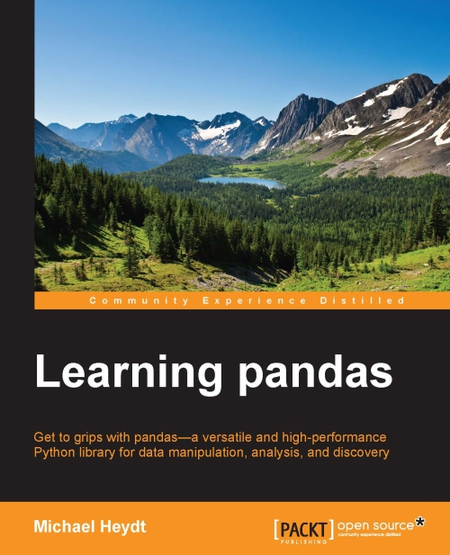

## Learning Pandas

* Publisher https://www.packtpub.com/application-development/learning-pandas

## Toc
[Chapter 1: A Tour of pandas](01_A_Tour_of_pandas.md)  
Chapter 2: Installing pandas  
[Chapter 3: NumPy for pandas](03_NumPy_for_pandas.md)  
[Chapter 4: The pandas Series Object](04_The_pandas_Series.md)  
[Chapter 5: The DataFrame Object](05_The_pandas_DataFrame.md)  
[Chapter 6: Accessing Data](06_Accessing_Data.md)  
[Chapter 7: Tidying Up Your Data](07_Tidying_Your_Data.md)  
[Chapter 8: Combining and Reshaping Data](08_Reorganizing_and_Reshaping_Data.md)  
[Chapter 9: Grouping and Aggregating Data](09_Grouping_and_Aggregating.md)  
[Chapter 10: Time-series Data](10_Time_Series_Data.md)  
[Chapter 11: Visualization](11_Visualization.md)  
[Chapter 12: Applications to Finance  ](12_Applications.md)  
