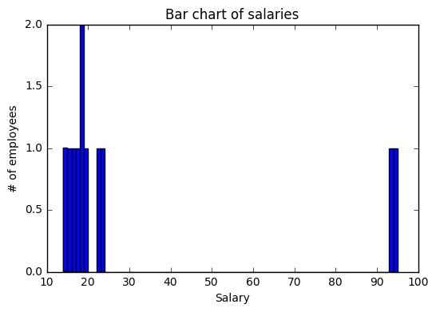

# Chapter 7: A Tour of Statistics – The Classical Approach
<!-- toc orderedList:0 depthFrom:1 depthTo:6 -->

* [Chapter 7: A Tour of Statistics – The Classical Approach](#chapter-7-a-tour-of-statistics-the-classical-approach)
  * [7.1 Descriptive statistics versus inferential statistics](#71-descriptive-statistics-versus-inferential-statistics)
  * [7.2 Measures of central tendency and variability](#72-measures-of-central-tendency-and-variability)
    * [Measures of central tendency](#measures-of-central-tendency)
    * [Measures of variability, dispersion, or spread](#measures-of-variability-dispersion-or-spread)
  * [7.3 Hypothesis testing – the null and alternative hypotheses](#73-hypothesis-testing-the-null-and-alternative-hypotheses)
    * [The null and alternative hypotheses](#the-null-and-alternative-hypotheses)
    * [Statistical hypothesis tests](#statistical-hypothesis-tests)
    * [Confidence intervals](#confidence-intervals)
    * [Correlation and linear regression](#correlation-and-linear-regression)
  * [7.4 Summary](#74-summary)
    * [Confidence intervals](#confidence-intervals-1)
    * [Correlation and linear regression](#correlation-and-linear-regression-1)
  * [7.5 Summary](#75-summary)

<!-- tocstop -->


## 7.1 Descriptive statistics versus inferential statistics
## 7.2 Measures of central tendency and variability

### Measures of central tendency
* The mean
* The median
* The mode


```python
import matplotlib.pyplot as plt
%matplotlib inline
```

* Computing measures of central tendency of a dataset in Python


```python
plt.hist([7,0,1,2,3,7,1,2,3,4,2,7,6,5,2,1,6,8,9,7])
plt.xlabel('x')
plt.ylabel('Count')
plt.title('Bimodal distribution')
plt.show()
```


```python
grades = [10, 10, 14, 18, 18, 5, 10, 8, 1, 12, 14, 12, 13, 1, 18]
# The mean, median, and mode can be obtained as follows:

%precision 3 # Set output precision to 3 decimal places

import numpy as np
np.mean(grades)

%precision
np.median(grades)

from scipy import stats
stats.mode(grades)

import matplotlib.pyplot as plt
plt.hist(grades)
plt.title('Histogram of grades')
plt.xlabel('Grade')
plt.ylabel('Frequency')
plt.show()
```


```python
%precision 2
salaries = [17, 23, 14, 16, 19, 22, 15, 18, 18, 93, 95]
np.mean(salaries)

fig = plt.figure()
ax = fig.add_subplot(111)
ind = np.arange(len(salaries))
width = 0.2
plt.hist(salaries, bins=range(min(salaries), max(salaries)).__len__())
ax.set_xlabel('Salary')
ax.set_ylabel('# of employees')
ax.set_title('Bar chart of salaries')
plt.show()
```





```python
np.median(salaries)
plt.hist(salaries, bins=len(salaries))
plt.title('Histogram of salaries')
plt.xlabel('Salary')
plt.ylabel('Frequency')
plt.show()
```


> The histogram is actually a better representation of the data as bar plots are generally used to represent categorical data while histograms are preferred for quantitative data, which is the case for the salaries' data.
For more information on when to use histograms versus bar plots, refer to http://onforb.es/1Dru2gv.

### Measures of variability, dispersion, or spread
* Range
* Quartile


```python
import random
random.seed(100)
testScores = [random.randint(0,100) for p in range(0,20)]
testScores
```


    [18, 58, 58, 98, 22, 90, 50, 93, 44, 55, 64, 14, 68, 15, 10, 94, 58, 33, 6, 84]


```python
#data needs to be sorted for quartiles
sortedScores = np.sort(testScores)

rankedScores = {i+1: sortedScores[i] for i in range(len(sortedScores))}

rankedScores
```


    {1: 6,
     2: 10,
     3: 14,
     4: 15,
     5: 18,
     6: 22,
     7: 33,
     8: 44,
     9: 50,
     10: 55,
     11: 58,
     12: 58,
     13: 58,
     14: 64,
     15: 68,
     16: 84,
     17: 90,
     18: 93,
     19: 94,
     20: 98}


```python
from scipy.stats.mstats import mquantiles
mquantiles(sortedScores)
```


    array([ 19.8,  56.5,  76.8])


```python
[np.percentile(sortedScores, perc) for perc in [25,50,75]]
```


    [21.00, 56.50, 72.00]


* Deviation and variance

## 7.3 Hypothesis testing – the null and alternative hypotheses
### The null and alternative hypotheses
* The alpha and p-values
* Type I and Type II errors

> * http://statistics.about.com/od/Inferential-Statistics/a/What-Is-The-Difference-Between-Alpha-And-P-Values.htm
* http://bit.ly/1GzYX1P
* http://en.wikipedia.org/wiki/P-value

* **Type I and Type II errors  **

> * Type I Error: In this type of error, we reject H0 when in fact H0 is true.
An example of this would be a jury convicting an innocent person for a
crime that the person did not commit.
* Type II Error: In this type of error, we fail to reject H0 when in fact H1
is true. This is equivalent to a guilty person escaping conviction.

### Statistical hypothesis tests

> For more details on this topic, refer to http://www.ats.ucla.edu/stat/mult_pkg/faq/general/tail_tests.htm.

* Background

> For more details on this topic, refer to http://stattrek.com/sampling/sampling-distribution.aspx and http://en.wikipedia.org/wiki/Central_limit_
theorem.

* **The z-test  **

> For reference, go to http://mathisfun.com/data/images/normal-distrubution-large.gif.


```python
 1 - stats.norm.cdf(3.75)
```


    0.00


> The typical values for α are 0.05 or 0.01. Following list explains the different values of alpha:
* p-value <0.01: There is VERY strong evidence against H0
* 0.01 < p-value < 0.05: There is strong evidence against H0
* 0.05 < p-value < 0.1: There is weak evidence against H0
* p-value > 0.1: There is little or no evidence against H0

* The z-test

* The t-test

> The reference of this image is from: http://zoonek2.free.fr/UNIX/48_R/g593.png.
A more detailed technical explanation on the relationship between t-distribution, z-distribution, and the degrees of freedom can be found at http://en.wikipedia.org/wiki/Student's_t-distribution.

* **A t-test example  **


```python
import pandas as pd
import numpy as np
feRawData = pd.read_csv('DATA/Chapter 7/2014_FEGuide.csv')
```


```python
feRawData.columns[:20]
```


    Index(['Model Year', 'Mfr Name', 'Division', 'Carline', 'Verify Mfr Cd',
           'Index (Model Type Index)', 'Eng Displ', '# Cyl',
           'Trans as listed in FE Guide (derived from col AA thru AF)',
           'City FE (Guide) - Conventional Fuel',
           'Hwy FE (Guide) - Conventional Fuel',
           'Comb FE (Guide) - Conventional Fuel',
           'City Unadj FE - Conventional Fuel', 'Hwy Unadj FE - Conventional Fuel',
           'Comb Unadj FE - Conventional Fuel',
           'City Unrd Adj FE - Conventional Fuel',
           'Hwy Unrd Adj FE - Conventional Fuel',
           'Comb Unrd Adj FE - Conventional Fuel', 'Guzzler? ',
           'Air Aspir Method'],
          dtype='object')


```python
feRawData = feRawData.rename(columns={'Trans as listed in FE Guide (derived from col AA thru AF)' :'TransmissionType',
                                      'Comb FE (Guide) - Conventional Fuel' : 'CombinedFuelEcon'})
```

### Confidence intervals


```python
transType=feRawData['TransmissionType']
transType.head()
```


    0      Auto(AM7)
    1     Manual(M6)
    2      Auto(AM7)
    3     Manual(M6)
    4    Auto(AM-S7)
    Name: TransmissionType, dtype: object


```python
transTypeSeries = transType.str.split('(').str.get(0)
transTypeSeries.head()
```


    0      Auto
    1    Manual
    2      Auto
    3    Manual
    4      Auto
    Name: TransmissionType, dtype: object


```python
feData=pd.DataFrame([transTypeSeries,feRawData['CombinedFuelEcon']]).T
feData.head()
```


<div>
<table border="1" class="dataframe">
  <thead>
    <tr style="text-align: right;">
      <th></th>
      <th>TransmissionType</th>
      <th>CombinedFuelEcon</th>
    </tr>
  </thead>
  <tbody>
    <tr>
      <th>0</th>
      <td>Auto</td>
      <td>16</td>
    </tr>
    <tr>
      <th>1</th>
      <td>Manual</td>
      <td>15</td>
    </tr>
    <tr>
      <th>2</th>
      <td>Auto</td>
      <td>16</td>
    </tr>
    <tr>
      <th>3</th>
      <td>Manual</td>
      <td>15</td>
    </tr>
    <tr>
      <th>4</th>
      <td>Auto</td>
      <td>17</td>
    </tr>
  </tbody>
</table>
</div>


```python
feData_auto=feData[feData['TransmissionType']=='Auto']
feData_manual=feData[feData['TransmissionType']=='Manual']
```

* An illustrative example
### Correlation and linear regression
* Correlation
* Linear regression
* An illustrative example
## 7.4 Summary


```python
feData_auto.head()
```


<div>
<table border="1" class="dataframe">
  <thead>
    <tr style="text-align: right;">
      <th></th>
      <th>TransmissionType</th>
      <th>CombinedFuelEcon</th>
    </tr>
  </thead>
  <tbody>
    <tr>
      <th>0</th>
      <td>Auto</td>
      <td>16</td>
    </tr>
    <tr>
      <th>2</th>
      <td>Auto</td>
      <td>16</td>
    </tr>
    <tr>
      <th>4</th>
      <td>Auto</td>
      <td>17</td>
    </tr>
    <tr>
      <th>6</th>
      <td>Auto</td>
      <td>16</td>
    </tr>
    <tr>
      <th>8</th>
      <td>Auto</td>
      <td>17</td>
    </tr>
  </tbody>
</table>
</div>


```python
len(feData_auto)
```


    987


```python
len(feData_manual)
```


    211


```python
np.mean(feData_auto['CombinedFuelEcon'])
```


    22.17


```python
np.mean(feData_manual['CombinedFuelEcon'])
```


    25.06


```python
import scipy.stats as stats
stats.ttest_ind(feData_auto['CombinedFuelEcon'].tolist(),
                feData_manual['CombinedFuelEcon'].tolist())
```


    Ttest_indResult(statistic=-6.5520663209014218, pvalue=8.4124843426106622e-11)


```python
stats.ttest_ind(feData_auto['CombinedFuelEcon'].tolist(),
                feData_manual['CombinedFuelEcon'].tolist(),
                equal_var=False)
```


    Ttest_indResult(statistic=-6.9493722625161132, pvalue=1.9954143680382091e-11)


### Confidence intervals
* **An illustrative example  **


```python
 import statsmodels.api as sma
 faithful = sma.datasets.get_rdataset("faithful")
 faithful
```


    <class 'statsmodels.datasets.utils.Dataset'>


```python
faithfulDf = faithful.data
faithfulDf.head()
```


<div>
<table border="1" class="dataframe">
  <thead>
    <tr style="text-align: right;">
      <th></th>
      <th>eruptions</th>
      <th>waiting</th>
    </tr>
  </thead>
  <tbody>
    <tr>
      <th>0</th>
      <td>3.600</td>
      <td>79</td>
    </tr>
    <tr>
      <th>1</th>
      <td>1.800</td>
      <td>54</td>
    </tr>
    <tr>
      <th>2</th>
      <td>3.333</td>
      <td>74</td>
    </tr>
    <tr>
      <th>3</th>
      <td>2.283</td>
      <td>62</td>
    </tr>
    <tr>
      <th>4</th>
      <td>4.533</td>
      <td>85</td>
    </tr>
  </tbody>
</table>
</div>


```python
len(faithfulDf)
```


    272


```python
import numpy as np
mean,std = (np.mean(faithfulDf['waiting']),
            np.std(faithfulDf['waiting']))
```


```python
from scipy import stats
N = len(faithfulDf['waiting'])
ci = stats.norm.interval(0.95,loc=mean,scale=std/np.sqrt(N))
```


```python
ci
```


    (69.28440107709261, 72.509716569966201)


> Reference for this information: http://statsmodels.sourceforge.net/devel/datasets/index.html and
http://docs.scipy.org/doc/scipy-0.14.0/reference/generated/scipy.stats.norm.html.

### Correlation and linear regression
* **Correlation**

> For more information on correlation and dependency, refer to http://en.wikipedia.org/wiki/Correlation_and_dependence.

* **Linear regression**

> For more information see: http://en.wikipedia.org/wiki/Power_law

* **An illustrative example**


```python
import pandas as pd
import numpy as np
import matplotlib.pyplot as plt
chirpDf = pd.read_csv('DATA/Chapter 7/cricket_chirp_temperature.csv')
chirpDf
```


<div>
<table border="1" class="dataframe">
  <thead>
    <tr style="text-align: right;">
      <th></th>
      <th>temperature</th>
      <th>chirpFrequency</th>
    </tr>
  </thead>
  <tbody>
    <tr>
      <th>0</th>
      <td>20.000000</td>
      <td>88.599998</td>
    </tr>
    <tr>
      <th>1</th>
      <td>16.000000</td>
      <td>71.599998</td>
    </tr>
    <tr>
      <th>2</th>
      <td>19.799999</td>
      <td>93.300003</td>
    </tr>
    <tr>
      <th>3</th>
      <td>18.400000</td>
      <td>84.300003</td>
    </tr>
    <tr>
      <th>4</th>
      <td>17.100000</td>
      <td>80.599998</td>
    </tr>
    <tr>
      <th>5</th>
      <td>15.500000</td>
      <td>75.199997</td>
    </tr>
    <tr>
      <th>6</th>
      <td>14.700000</td>
      <td>69.699997</td>
    </tr>
    <tr>
      <th>7</th>
      <td>17.100000</td>
      <td>82.000000</td>
    </tr>
    <tr>
      <th>8</th>
      <td>15.400000</td>
      <td>69.400002</td>
    </tr>
    <tr>
      <th>9</th>
      <td>16.200001</td>
      <td>83.300003</td>
    </tr>
    <tr>
      <th>10</th>
      <td>15.000000</td>
      <td>79.599998</td>
    </tr>
    <tr>
      <th>11</th>
      <td>17.200001</td>
      <td>82.599998</td>
    </tr>
    <tr>
      <th>12</th>
      <td>16.000000</td>
      <td>80.599998</td>
    </tr>
    <tr>
      <th>13</th>
      <td>17.000000</td>
      <td>83.500000</td>
    </tr>
    <tr>
      <th>14</th>
      <td>14.400000</td>
      <td>76.300003</td>
    </tr>
  </tbody>
</table>
</div>


```python
plt.scatter(chirpDf.temperature,chirpDf.chirpFrequency,
            marker='o',edgecolor='b',facecolor='none',alpha=0.5)
plt.xlabel('Temperature')
```


    <matplotlib.text.Text at 0x9cbe814080>


```python
plt.ylabel('Chirp Frequency')
slope, intercept = np.polyfit(chirpDf.temperature,chirpDf.chirpFrequency,1)

plt.plot(chirpDf.temperature,chirpDf.temperature*slope + intercept,'r')
plt.show()
```


```python
import statsmodels.api as sm
chirpDf = pd.read_csv('DATA/Chapter 7/cricket_chirp_temperature.csv')
chirpDf = np.round(chirpDf,2)
result = sm.formula.ols('temperature ~ chirpFrequency',chirpDf).fit()
result.summary()
```

    C:\Anaconda3\lib\site-packages\scipy\stats\stats.py:1327: UserWarning: kurtosistest only valid for n>=20 ... continuing anyway, n=15
      "anyway, n=%i" % int(n))


<table class="simpletable">
<caption>OLS Regression Results</caption>
<tr>
  <th>Dep. Variable:</th>       <td>temperature</td>   <th>  R-squared:         </th> <td>   0.697</td>
</tr>
<tr>
  <th>Model:</th>                   <td>OLS</td>       <th>  Adj. R-squared:    </th> <td>   0.674</td>
</tr>
<tr>
  <th>Method:</th>             <td>Least Squares</td>  <th>  F-statistic:       </th> <td>   29.97</td>
</tr>
<tr>
  <th>Date:</th>             <td>Sun, 15 Jan 2017</td> <th>  Prob (F-statistic):</th> <td>0.000107</td>
</tr>
<tr>
  <th>Time:</th>                 <td>01:07:59</td>     <th>  Log-Likelihood:    </th> <td> -19.777</td>
</tr>
<tr>
  <th>No. Observations:</th>      <td>    15</td>      <th>  AIC:               </th> <td>   43.55</td>
</tr>
<tr>
  <th>Df Residuals:</th>          <td>    13</td>      <th>  BIC:               </th> <td>   44.97</td>
</tr>
<tr>
  <th>Df Model:</th>              <td>     1</td>      <th>                     </th>     <td> </td>
</tr>
<tr>
  <th>Covariance Type:</th>      <td>nonrobust</td>    <th>                     </th>     <td> </td>
</tr>
</table>
<table class="simpletable">
<tr>
         <td></td>           <th>coef</th>     <th>std err</th>      <th>t</th>      <th>P>|t|</th> <th>[95.0% Conf. Int.]</th>
</tr>
<tr>
  <th>Intercept</th>      <td>   -0.3091</td> <td>    3.109</td> <td>   -0.099</td> <td> 0.922</td> <td>   -7.025     6.407</td>
</tr>
<tr>
  <th>chirpFrequency</th> <td>    0.2119</td> <td>    0.039</td> <td>    5.475</td> <td> 0.000</td> <td>    0.128     0.296</td>
</tr>
</table>
<table class="simpletable">
<tr>
  <th>Omnibus:</th>       <td> 0.525</td> <th>  Durbin-Watson:     </th> <td>   0.960</td>
</tr>
<tr>
  <th>Prob(Omnibus):</th> <td> 0.769</td> <th>  Jarque-Bera (JB):  </th> <td>   0.579</td>
</tr>
<tr>
  <th>Skew:</th>          <td>-0.196</td> <th>  Prob(JB):          </th> <td>   0.749</td>
</tr>
<tr>
  <th>Kurtosis:</th>      <td> 2.121</td> <th>  Cond. No.          </th> <td>    995.</td>
</tr>
</table>


```python
R = np.sqrt(result.rsquared)
R
```


    0.83514378678237433


> Thus, our correlation coeffiient is R = 0.835. This would indicate that about 84 percent of the chirp frequency can be explained by the changes in temperature.

> Reference of this information: The Song of Insects http://www.hup.harvard.edu/catalog.php?isbn=9780674420663

> The data is sourced from http://bit.ly/1MrlJqR.

> For a more in-depth treatment of single and multi-variable regression, refer to the following websites:
• Regression (Part I): http://bit.ly/1Eq5kSx
• Regression (Part II): http://bit.ly/1OmuFTV

## 7.5 Summary

> In this chapter, we took a brief tour of the classical or frequentist approach to statistics and showed you how to combine pandas along with the stats packages — __scipy.stats__ and __statsmodels__ — to calculate, interpret, and make inferences from statistical data.

> In the next chapter, we will examine an alternative approach to statistics, which is the Bayesian approach. For deeper look at the statistics topics that we touched on, please take a look at __Understanding Statistics in the Behavioral Sciences__, which can be found at http://www.amazon.com/Understanding-Statistics-Behavioral-Sciences-Robert/dp/0495596523.


```python

```
