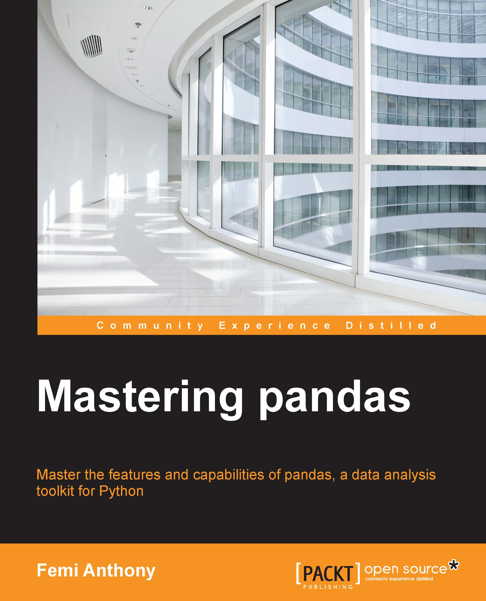

# Master Pandas

## info 
* [Publisher](https://www.packtpub.com/big-data-and-business-intelligence/mastering-pandas)

## toc
* [Chapter 1: Introduction to pandas and Data Analysis](Ch01_Introduction_to_pandas_and_Data_Analysis.md)
* [Chapter 2: Installation of pandas and Supporting Software](Ch02_Installation_of_pandas_and_Supporting_Software.md)
* [Chapter 3: The pandas Data Structures](Ch03_The_pandas_Data_Structures.md)
* [Chapter 4: Operations in Pandas, Part I – Indexing and Selecting](Ch04_Operations_in_Pandas,_Part_I_Indexing_and_Selecting.md)
* [Chapter 5: Operations in pandas, Part II – Grouping, Merging, and Reshaping of Data](Ch05_Operations_in_pandas,_Part_II_Grouping,_Merging,_and_Reshaping_of_Data.md)
* [Chapter 6: Missing Data, Time Series, and Plotting Using Matplotlib](Ch06_Missing_Data,_Time_Series,_and_Plotting_Using_Matplotlib.md)
* [Chapter 7: A Tour of Statistics – The Classical Approach](Ch07_A_Tour_of_Statistics_The_Classical_Approach.md)
* [Chapter 8: A Brief Tour of Bayesian Statistics](Ch08_A_Brief_Tour_of_Bayesian_Statistics.md)
* [Chapter 9: The pandas Library Architecture](Ch09_The_pandas_Library_Architecture.md)
* [Chapter 10: R and pandas Compared](Ch10_R_and_pandas_Compared.md)
* [Chapter 11: Brief Tour of Machine Learning](Ch11_Brief_Tour_of_Machine_Learning.md)

### [Chapter 1: Introduction to pandas and Data Analysis](Ch01_Introduction_to_pandas_and_Data_Analysis.md)
* Motivation for data analysis
  * We live in a big data world
  * 4 V's of big data
  * So much data, so little time for analysis
  * The move towards real-time analytics
* How Python and pandas fit into the data analytics mix
* What is pandas
* Benefits of using pandas
* Summary

### [Chapter 2: Installation of pandas and Supporting Software](Ch02_Installation_of_pandas_and_Supporting_Software.md)
* Selecting a version of Python to use
* Python installation
  * Linux
  * Windows
  * Mac OS/X
* Installation of Python and pandas from a third-party vendor
* Continuum Analytics Anaconda
  * Installing Anaconda
* Other numeric or analytics-focused Python distributions
* Downloading and installing pandas
  * Linux
  * Mac
  * Windows
* IPython installation
  * Linux
  * Windows
  * Mac OS/X
  * Install via Anaconda (for Linux/Mac OS/X
  * Wakari by Continuum Analytics
  * Virtualenv
* Summary

### [Chapter 3: The pandas Data Structures](Ch03_The_pandas_Data_Structures.md)
* NumPy ndarrays
  * NumPy array creation
  * NumPy datatypes
  * NumPy indexing and slicing
  * Copies and views
  * Operations
  * Broadcasting
  * Array shape manipulation
  * Array sorting
* Data structures in pandas
  * Series
  * DataFrame
  * Panel
* Summary

### [Chapter 4: Operations in Pandas, Part I – Indexing and Selecting]()
* Basic indexing
  * Accessing attributes using dot operator
  * Range slicing
* Label, integer, and mixed indexing
  * Label-oriented indexing
  * Integer-oriented indexing
  * The .iat and .at operators
  * Mixed indexing with the .ix operator
  * Multi-indexing
  * Swapping and re-ordering levels
  * Cross-sections
* Boolean indexing
  * The is in and any all methods
  * Using the where() method
  * Operations on indexes
* Summary

### [Chapter 5: Operations in pandas, Part II – Grouping, Merging, and Reshaping of Data](Ch05_Operations_in_pandas,_Part_II_Grouping,_Merging,_and_Reshaping_of_Data.md)
* Grouping of data
  * The groupby operation
* Merging and joining
  * The concat function
  * Using append
  * Appending a single row to a DataFrame
  * SQL-like merging/joining of DataFrame objects
* Pivots and reshaping data
  * Stacking and unstacking
  * Other methods to reshape DataFrames
* Summary

### [Chapter 6: Missing Data, Time Series, and Plotting Using Matplotlib](Ch06_Missing_Data,_Time_Series,_and_Plotting_Using_Matplotlib.md)
* Handling missing data
  * Handling missing values
* Handling time series
  * Reading in time series data
  * Time series-related instance methods
  * Time series concepts and datatypes
* A summary of Time Series-related objects
  * Plotting using matplotlib
* Summary

### [Chapter 7: A Tour of Statistics – The Classical Approach](Ch07_A_Tour_of_Statistics_The_Classical_Approach.md)
* Descriptive statistics versus inferential statistics
* Measures of central tendency and variability
  * Measures of central tendency
  * Measures of variability, dispersion, or spread
* Hypothesis testing – the null and alternative hypotheses
  * The null and alternative hypotheses
  * Statistical hypothesis tests
  * Confidence intervals
  * Correlation and linear regression
* Summary

### [Chapter 8: A Brief Tour of Bayesian Statistics](Ch08_A_Brief_Tour_of_Bayesian_Statistics.md)
* Introduction to Bayesian statistics
* Mathematical framework for Bayesian statistics
  * Bayes theory and odds
  * Applications of Bayesian statistics
* Probability distributions
  * Fitting a distribution
* Bayesian statistics versus Frequentist statistics
  * What is probability
  * How the model is defined
  * Confidence (Frequentist) versus Credible (Bayesian) intervals
* Conducting Bayesian statistical analysis
* Monte Carlo estimation of the likelihood function and PyMC
  * Bayesian analysis example – Switchpoint detection
* References
* Summary

### [Chapter 9: The pandas Library Architecture](Ch09_The_pandas_Library_Architecture.md)
* Introduction to pandas' file hierarchy
* Description of pandas' modules and files
  * pandas/core
  * pandas/io
  * pandas/tools
  * pandas/sparse
  * pandas/stats
  * pandas/util
  * pandas/rpy
  * pandas/tests
  * pandas/compat
  * pandas/computation
  * pandas/tseries
  * pandas/sandbox
* Improving performance using Python extensions
* Summary

### [Chapter 10: R and pandas Compared](Ch10_R_and_pandas_Compared.md)
* R data types
  * R lists
  * R DataFrames
* Slicing and selection
  * R-matrix and Numpy array compared
  * R lists and pandas series compared
  * R DataFrames versus pandas DataFrames
* Arithmetic operations on columns
* Aggregation and GroupBy
  * Aggregation in R
  * The pandas' GroupBy operator
* Comparing matching operators in R and pandas
  * R %in% operator
  * The pandas isin() function
* Logical subsetting
  * Logical subsetting in R
  * Logical subsetting in pandas
* Split-apply-combine
  * Implementation in R
  * Implementation in pandas
* Reshaping using Melt
  * The R melt() function
  * The pandas melt() function
* Factors/categorical data
  * An R example using cut()
  * The pandas solution
* Summary

### [Chapter 11: Brief Tour of Machine Learning](Ch11_Brief_Tour_of_Machine_Learning.md)
* Role of pandas in machine learning
* Installation of scikit-learn
  * Installing via Anaconda
  * Installing on Unix (Linux/Mac OSX
  * Installing on Windows
* Introduction to machine learning
  * Supervised versus unsupervised learning
  * Illustration using document classification
  * How machine learning systems learn
* Application of machine learning – Kaggle Titanic competition
  * The Titanic: Machine Learning from Disaster problem
  * The problem of overfitting
* Data analysis and preprocessing using pandas
  * Examining the data
  * Handling missing values
* A naïve approach to Titanic problem
* The scikit-learn ML/classifier interface
* Supervised learning algorithms
  * Constructing a model using Patsy for scikit-learn
  * General boilerplate code explanation
  * Logistic regression
  * Support vector machine
  * Decision trees
  * Random forest
* Unsupervised learning algorithms
  * Dimensionality reduction
  * K-means clustering
* Summary
Index
