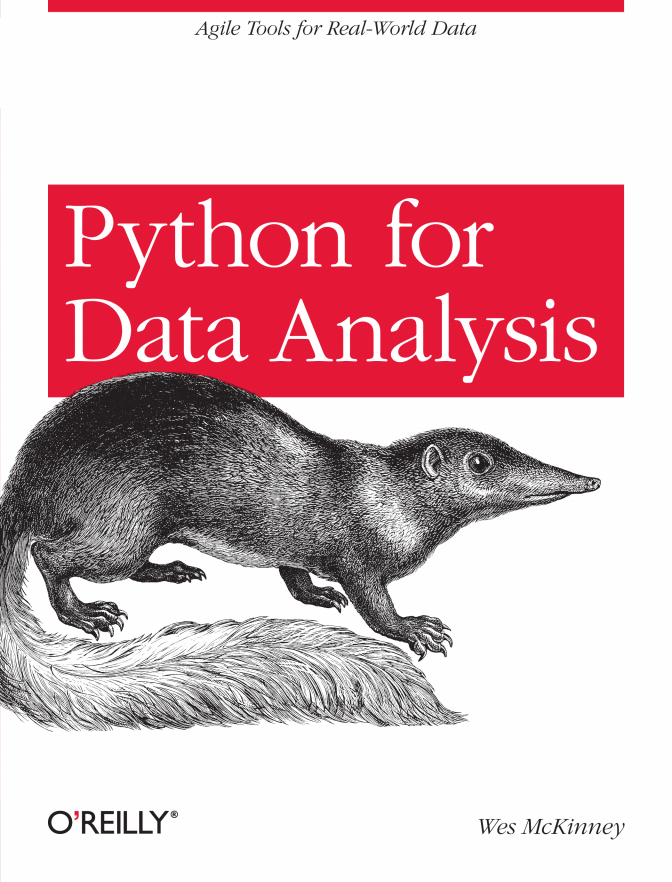

# Python for Data Analysis  
  

## TOC  
* [Chapter 1: Preliminaries](Ch01_Preliminaries.md)  
* [Chapter 2: Introductory Examples](Ch02_Introductory_Examples.md)  
* [Chapter 3: IPython An Interactive Computing and Development Environment](Ch03_IPython_An_Interactive_Computing_and_Development_Environment.md)  
* [Chapter 4: NumPy Basics](Ch04_NumPy_Basics_Arrays_and_Vectorized_Computation.md)  
* [Chapter 5: Getting Started with Pandas](Ch05_Getting_Started_with_pandas.md)  
* [Chapter 6: Data Loading, Storage, and File Formats](Ch06_Data_Loading_Storage_and_File_Formats.md)  
* [Chapter 7: Data Wrangling: Clean, Transform, Merge, Reshape](Ch07_Data_Wrangling_Clean_Transform_Merge_Reshape.md)  
* [Chapter 8: Plotting and Visualization](Ch08_Plotting_and_Visualization.md)  
* [Chapter 9: Data Aggregation and Group Operations](Ch09_Data_Aggregation_and_Group_Operations.md)  
* [Chapter 10: Time Series](Ch10_Time_Series.md)  
* [Chapter 11: Financial and Economic Data Applications](Ch11_Financial_and_Economic_Data_Applications.md)  
* [Chapter 12: Advanced NumPy](Ch12_Advanced_NumPy.md)  
* [Python Appendix](appendix_python.md)  
* [2012 Federal Election Commission Database](fec_study.md)  